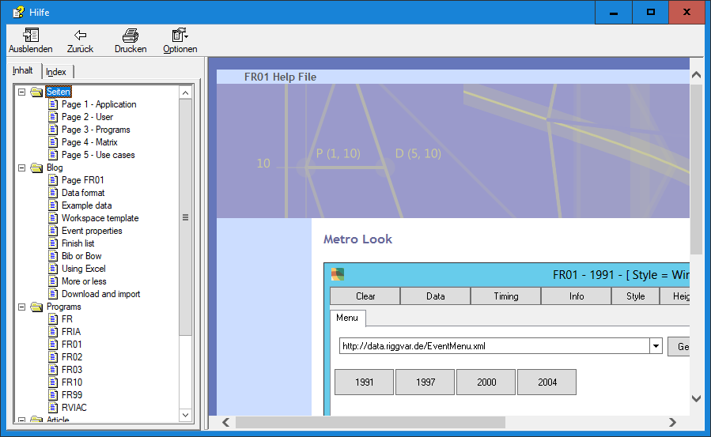

# About

FR Blog starts with the *operating instructions* for program FR01.

## Old .chm file, Compiled Html Help

## About FR01

[FR01](applications/FR01.html) is easy to use - it should be easy to use - I think it is.

But then, what is so special about that program?

The special thing is, that the data of the event, 
the regatta relating to one class of boat,
will always be downloaded to the client in the original version. 
The data will be complete, and can therefore be changed - newly computed on the client side.
FR is the first commonly available result system, which strictly follows this approach.

The usual reports of sailing regatta results usually omit information.
For example, the finish position of a boat that was disqualified after finishing will not be included.
With incomplete information, no what-if-analysis can be carried out on the client side. 
That's why there is FR - with complete data and freely available tools on the client side.

FR01 on the desktop marks the starting point.

Tablet and Phone may follow.

