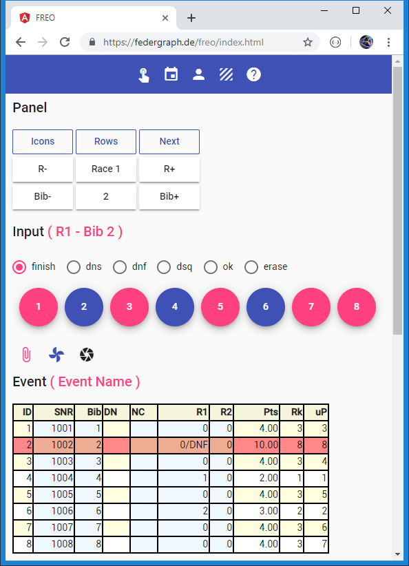

# Fleetrace Event Only App

*Screenshot of Freo SPA app.*<br>


The last action taken in the picture above has been: **Bib 2** was tapped on, while `dnf` was selected.
Note that the radio button selection jumps back automatically to the default value of `finish`.
Previously the finish of Bib 4 and Bib 6 had been recorded.
We are in Race 1 (**R1**) and Bib 2 (bow number 2) is currently selected because it was last used.

If you look at the Pts column you may notice that R2 contributes 1 point for all entries.
You can make this more obvious by showing points instead of finish positions in race columns.
And you could fix it by setting R2 to disabled, or by removing race 2 altogether.
There is no button for setting a race to disabled status in Freo, but it can still be accomplished.

You should prepare the event for download, so that users will find the event to be ready to go,
ready for timing data input, for the finish positions of the current race.

## External Link

[Start FREO](https://federgraph.de/freo/index.html){: .start-btn }

## About FREO

An Angular / Typescript application for FR.

FREO is the **Event Only** version.

You can record timing data (finish positions and penalty/status value assignments).
The current standing is computed by the App.

## Getting Started

> This help text may be more current than the help text built into the app.

I recommend that you try out the following steps, it should work:

1. Click Reset button, it will load the default test event and show the event table below the input area.
1. The test event has two races.
1. Navigate through the races with R- and R+ buttons.
1. Click Next button, it will take you to Race 1.
1. Because button Next has figured out where we are in the progress of the event - the first race.
1. Notice how the current race is displayed as part of the input header line.
1. Click on the circular fab buttons (floating action buttons).
1. At least once: select the dnf radio button before you click.
1. Notice how the radio selection will jump back to finish when you click a fab.
1. The fab just clicked will turn blue.
1. Click Next again when all fabs have been used.
1. You will be advanced to the next race, please check.
1. Continue with the fabs.
1. Play with the toolbar icon buttons, most of them have the Reduce To action type.
1. Some of the buttons will toggle, some will show, hide, or have an action type of Reduce To.
1. Go ahead and input finish positions for Race 2.
1. There are only two races in this test event.
1. When done, examine that series scoring is correct in table event.
1. Adjust the number of throwouts with button T+ and T-.
1. Note that you can sort the html table with a click on the column header.
1. Find the Pre-Text area and use it to copy result data in compact format to the clipboard.
1. Try and paste the text data you just copied into your favorite code editor program.
1. I assume that you test in Chrome on the desktop before you use it on a tablet or even a phone.

You need to input a finish position or a status value for all the entries in a race.

- A regatta has events.
- An event is sometimes called a division.
- An event has races and entries, columns and rows.
- The entries in a race are called bibs, corresponding to bows or bow numbers.
- By tapping on fabs you finish off bibs until done.
- You can assign a status value like dnf to a bib instead of a finish position.
- You can also erase the time for the current bib or reset the status to ok.

Some magic will be used, called strict input mode.

- When you click a fab - a message is generated with a finish higher than the numbers of entries in the race.
- In strict input mode the program automatically maintains a contiguous range of finish positions.
- You do not have to worry about the actual position.
- The entry will receive the next free position.
- Just tap on a fab, the rest is automatic.
- Note that when an event is loaded, it is done in relaxed input mode, and actual finish positions will be used.

On the desktop with only eight entries in the race, everything seems to be fast and snappy.

- You can watch both tables while you are finishing off bibs.
- You can afford to compute the whole event after each message.
- But the phone cannot show big tables.
- Small devices may be slow if everything is computed and displayed after each input message.
- They will be slow if the number of entries in the event is big.
- This is when you should use the message queue.
- Use of the queue is toggled with the paper clip icon button.
- When the queue is active you see two additional icons.
- When using the queue, you need to manually trigger the processing of recorded messages.
- Just click on the button that has the blue badge for the number of items in the queue.
- You can discard the content of the queue and / or show the content of the queue in Pre-Text.

Change data, make corrections for a bib in a race.

- Select the bib first!
- The bib from last used fab is already selected as current bib.
- But you can make any of the bibs current with Bib- and Bib+
- Pay attention to the radio buttons, select erase or ok to clear position or status.
- Then the blue toy button will do the trick.
- Note that you can do private what-if analysis in downloaded event data.
- For example: What-if I had not been disqualified.

What if there are problems, mistakes, special situations?

- What if I need to enter a percent penalty or a dpi penalty?
- What if you need to correct a finish position?
- You can edit the text data of the event and reload.
- Use the Text-Area html element to do this.
- Learn from the provided examples.
- The examples will show you what the message format looks like.
- To correct a finish position, add a race value message after switching to strict input mode.
- Then press the read button.

```
//im text area input element ...
//... event data, geladen mit EP.IM = Relaxed (Input Mode Relaxed)
//... relaxed input mode ist implizit beim Lesen

EP.IM = Strict
FR.*.W2.Bib2.RV=4
```

Copy the finish positions from the black board after the fact.

- This is a great use case.
- You form a team of two.
- One will read the finish list.
- The other will tap on the fabs.
- At first race: Create a new event with the appropriate start list count and race count.
- Don't forget to Save to local storage.
- The next day, press Load before you continue with the next race.

We take it easy with athlete names in this app.

- When race timing starts, entry registration has already finished.
- When you do race timing you do not care about athlete names.
- Entry info should be inserted into the prepared event data text you start out from.
- My test data does not include athlete's names anyways.
- And the entries table most often will be empty.
- In the light version I have removed all UI for Entries.

Start with the recording of finish positions.

- Let's hope that *they* have provided for consecutive bow numbers starting at 1.
- For learning about the data format, have a look at normal and compact text output in the Pre-Text area.
- You can bring up the Pre-Text area or Text-Area area with an icon button.
- Please test on the desktop browser where you have a good keyboard and where it is convenient to use the clipboard.

## Current Version

The current version is on GitHub, see repository **FR03E1**.

FREO, as linked to above and FR03E1 on GitHub are not exactly the same, but almost.

The SPA application FR03E1 is intended to be served by the der Delphi application or a Node.js or a ASP.Net application,
in general: a server which implements an Api, and which will accept uploaded data.

FREO cannot accept uploads, but FREO can store data in Local Storage *within* the Browser,
I have no idea if you want to use it, how usable that is.
You can change that if you want, it is Open Source.

```
Local Storage Key = 'fr-event-data'
```

[Top](#)
