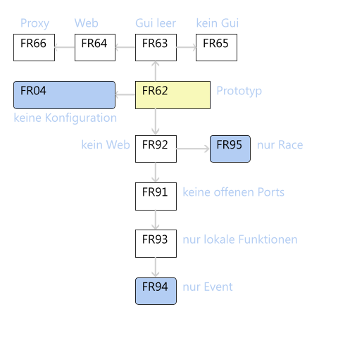
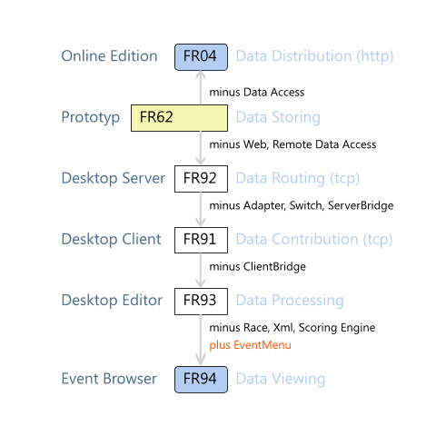



# FR (Fleetrace)

### General Thoughts
FR was designed as a flexible network enabled program.
Protocol and interfaces were specified by RiggVar Software with easy monitoring and authoring of unencrypted messages in mind (without need of manual).

The more important design decisions of application FR are:

- All endpoints (downstream) will calculate results (calc everywhere).
  Therefore, data can be manipulated independently at the client (what if analysis).
  Changes by the user can be private or public (more demanding).
- Only the real input data will be saved and transmitted, not any calculated results.
- All data is in the form of readable text, no binary encoded data is used.
- The protocol is self specified. (read: domain specific language)
- Ease of portability is achieved by not using 3rd party components.
- Optimal combinations of components can be deployed because of available implementations of the systems on more than one major software development platform.
  For example, deployed components could be: Ajax timing client, Delphi result server, Silverlight result client, Java result client.
- Individual nodes of the system can be networked in a flexible way.
- By the general design, every node can be a source of data.
- Processing of data is transparent and equal handed.
Every node receives the complete set of input data.
Every node has access to the algorithm.

The principle of 'compute everywhere' is in contrast to the rule
where only one node is allowed to calculate results and the rest will get static reports.
If all are able to calculate results and the same algorithm is e.g. implemented in C# and in Java,
then it is of cause possible in theory and reality that result may not match exactly.
RiggVar Software will use this situation of concurrency in a constructive manner in its internal QA process.

The mechanism contained in the project of automatically forwarding data to connected nodes
provides a similar service to the system of what is known from a Chat-Server or a message oriented middleware (MOM).
However, the implementation uses only the usual socket components and is part of the framework.
To start using it the user does not need an account.

### Real Projects

#### Development Path
FR is a family of programs. On a particular every development platform there are several targets.

Starting from prototype FR62 there are four lines of development:
- The server line with FR63 as start point (w/o UI).
- The online path with FR04 as start point (w/o configuration and w/o data access).
- The editor line with FR92 as start point (w/o web interface).
- The feature line with FR38 and FR98 as example.

#### Server Line
The server line removes the UI, so that the program can be used as server.
The web interface and data access are kept in the program.

- FR63: desktop application with empty GUI
- FR64: web application (including algorithm, calculates results)
- FR65: (Windows) service.
- FR66: web application (proxy)

#### Online Path
The online path removes data access including file based configuration and emphasizes the web interface.
The program will be started on a network visible machine and runs without attention,
as long as the server functions are needed.
The administration is done from remote.

- FR04: Desktop Edition.
- FR05: Home Server Edition
- FR06: EC2 Edition

#### Editor Line
The Editor Line removes the web interface and the step by step the remaining network functions,
so that a locally operating program results,
that can be used to edit data, which is loaded from disc.

- FR92: Program version w/o web interface
- FR95: Race Data Manager
- FR91: Bridge Client Edition
- FR93: Local Editor
- FR94: Event Data Viewer

#### Feature Line
The feature line extracts a single feature out of the prototype application.
Messages that were previously sent via the internal connection are now sent from a separate program via the network.

- FR38: Timing client (Timing-Tab as standalone program).
- FR90: Pocket Timer Adapter.
- FR98: Output client (Browser-Tab, Report-Tab as standalone program,
program will be notified of changes via tcp.)
- FRXX: External Server Bridge
- FRXX: Scoring Module
- FRXX: Scoring Server
- FRXX: Switch Server
- FRXX: Switch Clients

The members of this line of development usually share only a minimum of common code.
In contrast, the potential variety is especially big.

