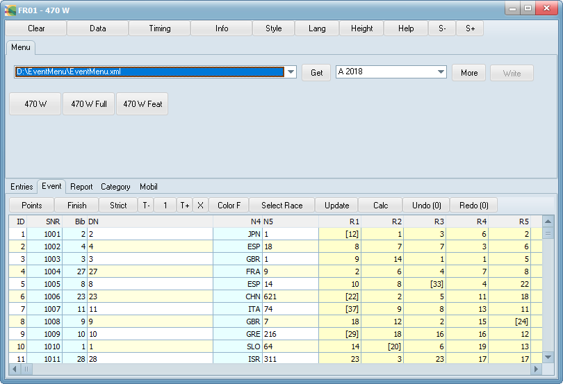



# FR01

## Update 2019

The source code of FR01 is now available at GitHub.
Please compile the application from latest source.

## Update 2012

FR is a modern result program for event data (of a sailing regatta) accessible via the Internet.

Example: Immediately after the third race you click on a button in FR01 to download the current standing after race 2.
Now you can quickly enter the finish positions of race 3.
It will take less than a minute if you have prepared the finish list with paper and pencil or if you get the results via phone.
You can then interactively change the number of throwouts, delete or add penalties, and alter finish positions to see how it looks.
The client program (e.g. FR01) computes and sorts the results in real time.
It is of cause better than the browser, with only the Silverlight application (runs within the browser) coming close. 

Your input can be posted back to the server, if this is configured and administered properly.
In theory, only one (volunteer) must do the work for the download to stay (almost) current during the event.

FR01 will be available for the major computer platforms.
You can download the Windows version now. 

The data that is produced and consumed by FR01 is a valid html fragment,
which can be easily embedded in a page on the website of the event.
