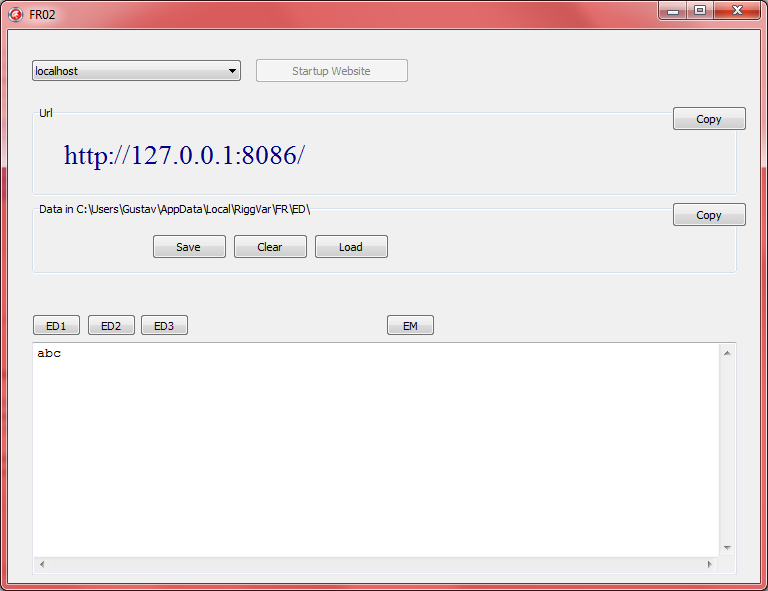



# FR02

## Update 2012

FR02 contains a minimalistic Website that is ready to accept posted event data from FR01.

The event data server can be implemented with different technologies on different places in different sizes.
From static files on the local machine to scalable cloud computing everything is possible.

FR02 is a good start, the program is extremely easy to use, and in many cases more than enough to support the local event.
