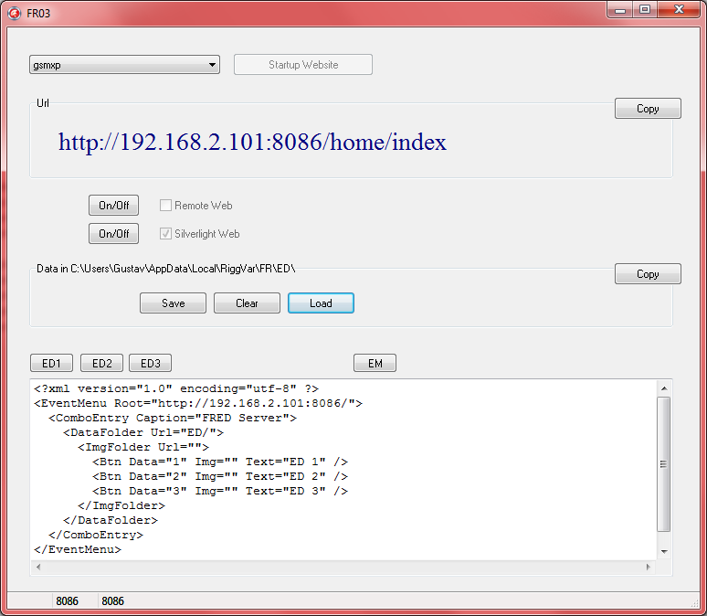



# FR03

## Update 2012

FR03 is an enhanced version of FR02.

The client, e.g. FR01, can download data from the server, 
change it (add data for the current race) and possible also upload data.

The data uploaded from FR01 consists of an html fragment, ready to be embedded in a page.
The server does merely more than add the frame around the event data.

In contrast to FR02, a simplistic variation of a server,
FR03 sports a frame of some style, sorting and optionally a Silverlight client.

Here is a list of the potential clients:

- Browser without Javascript 
- Browser with Javascript 
- Browser with Silverlight (FRIA) 
- FR01 as a *replacement* of the Browser (better, because it is a copy of the original application itself)

The event data will also work with a real implementation of a *proper* server,
one that is located on the Internet instead of on the local machine.
			