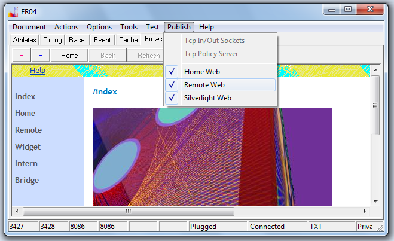
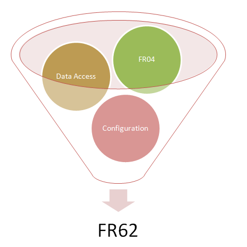



# FR04

## Base Version

FR04 is a reduced/stripped down variation of FR62. 
FR04 does not store anything on disc. 
There is no configuration file. 
Therefore you have the same environment every time the application is loaded. 
The use of FR04 is as easy as the use of the Silverlight client.

FR04 can load data from the web (via http) and has all FR collaboration features.

## Feature Matrix of FR04 Variations

Programs FR04 A-I are different only in hard coded configuration settings.

The **D** variant is used as a server. 
The missing configuration file does not create a problem, 
because the IP address the sockets are opened on can be determined dynamically. 
Variations **E** and **F** have small changes over **D** only in regard to the deployment scenario.

With the client versions **A, B, C** and **I**, 
the missing configuration file will result in a usage constraint to the local machine. 
Some small changes to the hard code application values may be requested by the user of the program.

<table>
    <thead>
        <tr>
            <th>Feature</th>
            <th>A</th>
            <th>B</th>
            <th>C</th>
            <th>D</th>
            <th>E</th>
            <th>F</th>
            <th>G</th>
            <th>H</th>
            <th>I</th>
        </tr>
    </thead>
    <tr>
        <td></td>
        <td>RO</td>
        <td>WO</td>
        <td>BC</td>
        <td>BS</td>
        <td>HS</td>
        <td>EC2</td>
        <td>Selection</td>
        <td>WS</td>
        <td>OB</td>
    </tr>
    <tr>
        <td>UI</td>
        <td>x</td>
        <td>x</td>
        <td>x</td>
        <td>x</td>
        <td>x</td>
        <td>x</td>
        <td>x</td>
        <td>-</td>
        <td>x</td>
    </tr>
    <tr>
        <td>Sockets</td>
        <td>-</td>
        <td>-</td>
        <td>x</td>
        <td>x</td>
        <td>x</td>
        <td>x</td>
        <td>?</td>
        <td>x</td>
        <td>-</td>
    </tr>
    <tr>
        <td>Web</td>
        <td>-</td>
        <td>x</td>
        <td>-</td>
        <td>x</td>
        <td>x</td>
        <td>x</td>
        <td>?</td>
        <td>x</td>
        <td>-</td>
    </tr>
    <tr>
        <td>Server Bridge</td>
        <td>-</td>
        <td>-</td>
        <td>-</td>
        <td>x</td>
        <td>x</td>
        <td>x</td>
        <td>?</td>
        <td>x</td>
    </tr>
    <tr>
        <td>Client Bridge</td>
        <td>-</td>
        <td>-</td>
        <td>x</td>
        <td>-</td>
        <td>-</td>
        <td>-</td>
        <td>?</td>
        <td>-</td>
        <td>-</td>
    </tr>
    <tr>
        <td>Output Bridge</td>
        <td>-</td>
        <td>-</td>
        <td>-</td>
        <td>-</td>
        <td>-</td>
        <td>-</td>
        <td>?</td>
        <td>-</td>
        <td>x</td>
    </tr>
    <tr>
        <td>dynamischer Silverlight client</td>
        <td>-</td>
        <td>-</td>
        <td>-</td>
        <td>x</td>
        <td>x</td>
        <td>x</td>
        <td>?</td>
        <td>x</td>
        <td>-</td>
    </tr>
    <tr>
        <td>statischer Silverlight client</td>
        <td>-</td>
        <td>x</td>
        <td>-</td>
        <td>x</td>
        <td>x</td>
        <td>x</td>
        <td>?</td>
        <td>x</td>
        <td>-</td>
    </tr>
    <tr>
        <td>Szenario Auswahl</td>
        <td>-</td>
        <td>-</td>
        <td>-</td>
        <td>-</td>
        <td>-</td>
        <td>-</td>
        <td>x</td>
        <td>-</td>
        <td>-</td>
    </tr>
</table>

**A** *Read Only Scenario*
The Read Only variant does not open sockets (tcp or http). 

**B** *Web Only Scenario*
Tcp sockets are not opened, http sockets are. 
Because no tcp connections are possible, 
only static Silverlight clients can be attached.

**C** *Bridge Client Scenario*
C can be started together with D on a single machine.
There will be no port conflict, because C does not open any sockets.
The Host parameter for the client bridge connection in C is hard coded to the local machine.

**D** *Bridge Server Scenario*
D is the is the server application for the intranet.

**E** *Home Server Deployment Scenario*
Home web and Remote web are opened on different ports 
and are available via a proxy from the Home and Remote website of Windows Home Server. 
The connection to the Remote web requires the use of the https protocol.

**F** *EC2 Deployment Scenario*
F is targeted for deployment on a virtual machine instance in the Elastic Compute Cloud (EC2) of the Amazon Web Services offering.
All absolute Urls used to connect the Silverlight client back to the server application 
are set to the public IP address of the virtual machine, which is queried dynamically by the program.

**G** *Szenario Selection*
A selection form is shown at program start time to select a scenario. 
According to the selected scenario the program will behave like A-F, or I.

**H** *Windows Service Scenario*
Like in D, but but implemented as a Windows Service.

**I** *Output Bridge Szenario*
Like C, but uses a connection via the output bridge. 
The output bridge enables a read only connection using the normal output socket of FR04. 
The Host parameter for the client bridge connection of I is hard coded to the local machine. 

