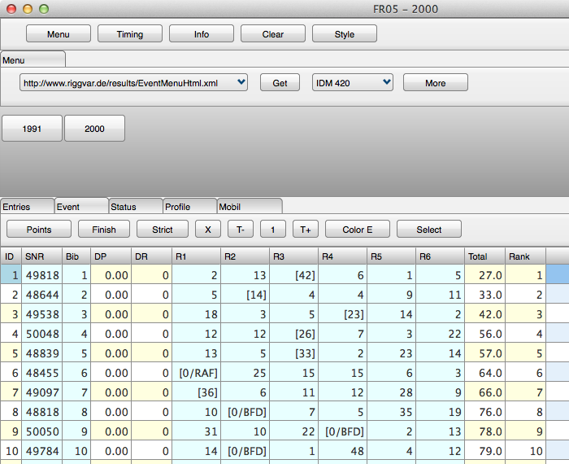



# FR05

## Update 2012

FR05 is much like FR01, except that it is compiled with the Firemonkey UI library from Embarcadero (Delphi XE2).

The program can be compiled for Windows (32 / 64 Bit) as well as Max OS X.
