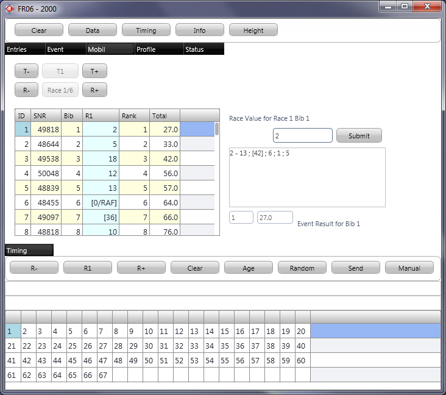



# FR06

## Update 2012

FR06 is comparable to FR01, but it compiles under FPC with the Firemonkey iOS library of Embarcadero (Delphi XE2).

FR06 is a copy of the FR01 project with customizations directed to the use on IPhone/IPad.

Start testing FR01 under Windows, then if you want to use the program on another platform (iOS, Android, Linux, Mac OS X), please ask.

With the FR01 project a feature set was specified that will be made available throughout a set of clients, 
including the touch screen devices. 
The direction of Project FR has changed a bit with FR01 (and FR05/FR06/FR08). 
Only small updates are expected for the documentation effort here on the static pages (2010 - 2011). 
Talk on current development will probably shift over to the Blog on www.fleetrace.org. 
