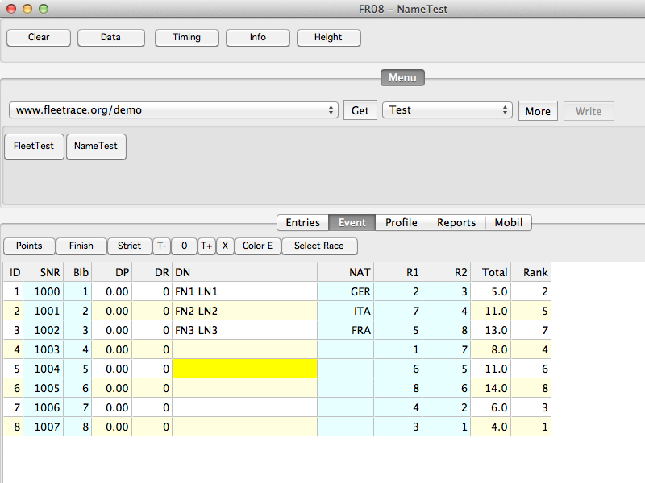



# FR08

## Update 2012

FR08 ist vergleichbar mit FR01, nur kompiliert mit FPC (Free Pascal Compiler) in der Lazarus IDE, 
getestet unter Windows, Mac OS X und Ubuntu.

Möglicherweise ist FR08 zur Zeit die beste Variante für Max OS X.

FR08 läuft gut unter Ubuntu.
