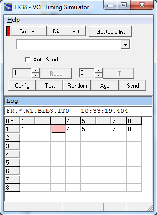



# FR38

FR38 is an external timing client that can connect via tcp to the FR server.

The operation of FR38 is easy. 
Using the mouse or keyboard arrow keys the user selects a Bib in the grid first. 
Then a time is generated using the space bar. 
In the sport of sailing the Bib usually is identical to the bow number.

The race part of project FR is independent of the type of sport. 
This is why the usual terms are used. IT stands for Intermediate Timepoint. 
IT0 is the finish time point. 
This is because there is always a finish and it makes sense to count the real ITs (mark roundings) from IT1. 
The FT alias (Finish Time) can always be used instead of IT0. 

At the server side the finish position will be derived from the time. 
Sailing is a timing sport even if only the finish positions are recorded.

The message with the generated time is always displayed in the white text field. 
The Send button sends the time and also copies the message text to the blue text field. 
If the Auto Send check box is marked, 
the time is immediately sent. 
Make sure Auto Send is off when you are just trying things out.

With Auto Send off you can edit the message before sending it. 
This way it is possible to send a penalty assignment for an entry in a race. 

There are a number of options. For example you could send a message to a web service 
or download the configuration of the connection from a web server.

The system time of the client computer is used to generate the time. 
In order to achieve a higher precision you need to connect a real timer and convert the data to the FR protocol. 
This is what RiggVar Software offers as a service.

The configuration of the connection to the server includes parameters Host and Port. 
These parameters are stored in the configuration file. 
You could update this information prior to starting up the program. 
Using the Test button, a test message can be generated that will not change the state of the server. 
Random button helps with testing the system, 
and Age button resets the background color of Bib number cells already used.

Please send us an email, if you want to try out FR38 online. 
We will provide you with up-to-date information about the FR38 download, 
parameters host and port for connecting to the test server, 
and where to find the Silverlight client used to check results.
