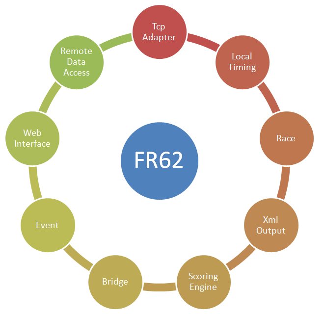



# FR62

## FR Prototyp

FR62 is the full featured prototype of project FR.

In many cases it makes sense to use stripped down versions 
which sometimes can be used without a configuration file.

We make sure that all reduced feature set derivatives can be compared at source code level to FR62. 
Changes to projects can so be merged back into FR62. 
It is also easy to check which features were removed from the lighter versions, 
or what features are still present in a project.

## Quick configuration using scenario selector

FR62 can be tuned to the task and environment by means of the configuration file. 
The scenario selector was added to easily choose between favorite configuration settings.

When FR62 starts up you can choose among the following scenarios:

<dl>
<dt>Default</dt>
<dd>Settings are read from the configuration file and used as is.</dd>

<dt>Disconnected</dt> 
<dd>All server side network connection points are deactivated, both tcp and http. 
The web interface can be reactivated by means of the graphical user interface.</dd>

<dt>Read only</dt>
<dd>The application behaves Read only as far as the network is concerned. 
You can load data from disc as usual. The Home web, which does not allow changes to data, 
is activated. Remote web and the Silverlight web are not activated. Tcp Sockets are deactivated. 
The configuration file on disc is not written to when the program terminates.</dd>

<dt>Bridgeserver LH</dt>
<dd>The Bridge server connection point is opened on the localhost interface only. 
This means that testing on the local machine is possible, 
but the application is not available on the intranet or beyond.

The Bridge server scenario is probably the most interesting one. 
Using the Silverlight web you can immediately start browsing to the Silverlight client. 
Some variations of the Silverlight client (e.g. FRIA03) 
can make use of the Bridge server to establish a tcp connection back to FR62.</dd>

<dt>Bridgeserver</dt>
<dd>The Bridge server is activated on all network interfaces of the local machine. 
Doing so, the application is available from bridge clients on the network. 
The network scope is usually limited only by firewall settings. 
Other settings are evaluated normally.</dd>
</dl>

## Storing location of files

FR62 stores data in the 'RiggVar Workspace'. 
In the normal case the RiggVar Workspace is a subfolder in the user documents area. 
All files stored by the program are therefore within the reach of the user for editing and manual deletion.

From the programs point of view the workspace is accessed by means of an interface, 
for which there are several implementations. 
Many storage locations can be accessed at least in read only mode. 
The workspace can actually be located within a database, 
so that no files are stored on the local disc. 
In any case, the workspace contains only readable text files or streams of text. 

## Loading data from the web

FR62 can not only serve data to the web, it can consume data from the web too.

Data can be loaded from any location on the web, where a valid EventMenu.xml is available.

You use the web menu feature to load data from the web. 
You can load test data from folder Results or data that you serve via [FR97](FR97.html). 
Using the web menu, FR62 can also surf to itself or to another instance of the program running on a different computer.

## Providing data

All network features are optional and can be deactivated. 
When the program starts first (with the default configuration), 
no network features are active. Possibly the most important network feature is serving data from the integrated website. 
This is because much of the recently added functionality relies on it. It is an enabling feature. 

The integrated website of FR62 is configured by default such that the data in the workspace is served via http. 
You can work as usual within the workspace, 
and the data you are working on (in memory, current) as well as the data in the workspace (on disc) 
may be made available via the web interface.

When serving data via the web interface, text files from the workspace are converted to Xml automatically. 
The EventMenu.xml directory file for the Silverlight client is dynamically to match the content of the workspace.

The event data files can be extracted from the local workspace and placed on a more powerful web server. 
The Silverlight client [FRIA05](../silverlight/FRIA05) may be the most important consumer of the event data. 
It could be downloaded from the site integrated into FR62 or from any other website, 
together with the event data itself.

Independent of the Silverlight client, FR62 is providing html reports which can be consumed by a browser directly. 
These reports can be placed on a dedicated web server too.

## Collecting data

From the early days of the development, 
FRXX programs could receive timing data via the network. 
The data acquisition interface could well be the real most important point in favor of use of the FR system. 
You can use the traditional [FR38](FR38.html), use a browser widget, 
send data from the smart phone, or test new possibilities with [FRIA09](../silverlight/FRIA09). 
While receiving data for the current race, you could provide live coverage of mark roundings and finishes to interested parties, 
again by using a more classical solution [FR98](FR98.html), 
as usual by clicking in the browser or with [FRIA11](../silverlight/FRIA11), 
one of the latest Silverlight applets. 

