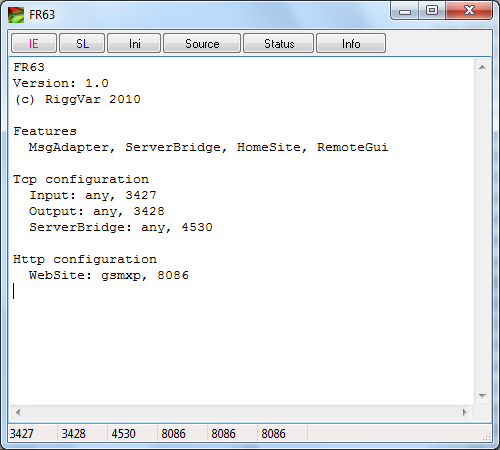
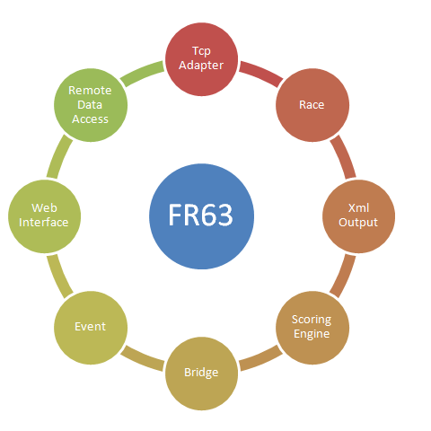



# FR63

FR63 is a feature reduced version of [FR62](FR62).

The UI of the program is almost empty. 
Therefor the application is more suitable for head-less operation as a server.
The network functionality is still in the program. 
FR63 as a desktop application can be configured and started up exactly as FR62.

FR63 can be understood as a first step in the direction of head-less operation. 
With the Windows Service application FR65 the last window was removed.
FR63 has the same combination of features as FR65, but can be debugged more easily. 
FR63 should be used when there is an operator, an interactive user, 
who will log on to the system and start up the program. 
What can be started up easily can also be closed down easily.

