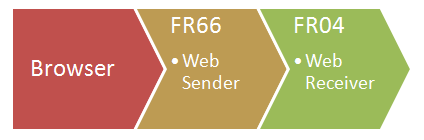



# FR66

FR66 ist eine Desktopanwendung mit einer eingebetteten
Proxywebsite und einer Socket Verbindung zur FR Applikation. Die in
FR66 eingebettete Website ist die ausgelagerte Version der
normalerweise direkt in der FR Applikation enthaltenen Website.

FR66 enthält also nur die Weboberfläche, nicht die Berechnungen.
Die statuslose Weboberfläche benutzt die (stehende) Netzwerkverbindung zur statusbehafteten FR Applikation, 
um Teile für die Antwort auf Http-Anforderungen von der FR Applikation bereitstellen zu lassen.

Die Gegenstelle in der FR Applikation (z.B. FR04) kann auf genau die gleiche Weise 
auch von anderen Implementierungen der Website angesprochen werden. 
Dazu muss die jeweilige Webanwendung in der Lage sein, 
eine Netzwerkverbindung zur FR Applikation herzustellen.

Es ist Ihnen freigestellt, mit beliebiger Technologie eine Website zu implementieren. 
Sie können FR als Backend weiter nutzen und sich innerhalb eines Ersatzes für FR66 
auf die Aspekte Darstellung (Stil) sowie Zugriffsermöglichung/Zugriffsbeschränkung konzentrieren.

Die von FR66 zur Verfügung gestellten Funktionen erleichtern außerdem den Test des Systems.
