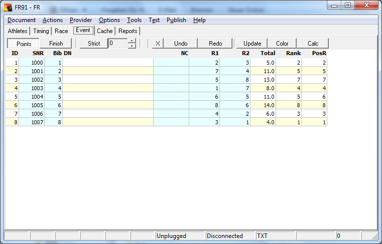
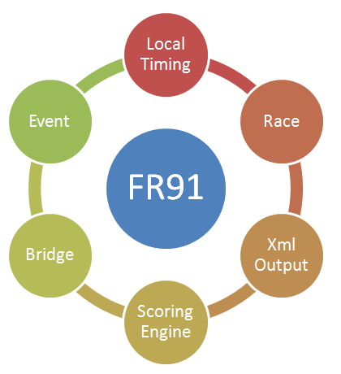
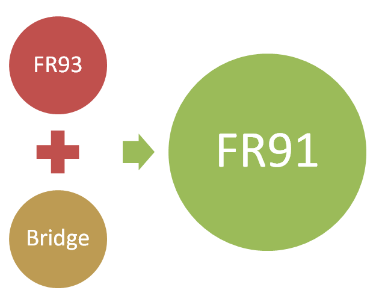



# FR91

FR91 meets the following use cases:
- Viewing of competition data. 
- Converting data to FR-Txt format. 
- Converting data to FR-Xml format. 

In contrast to FR92 the following features were removed:
- Adapter 
- Web Receiver 
- Switch 
- Server Bridge 

In contrast to FR93 the following features were added:
- Client Bridge 

Driving intent for the FR93 feature cut:
- The program shall no longer have open ports. 

