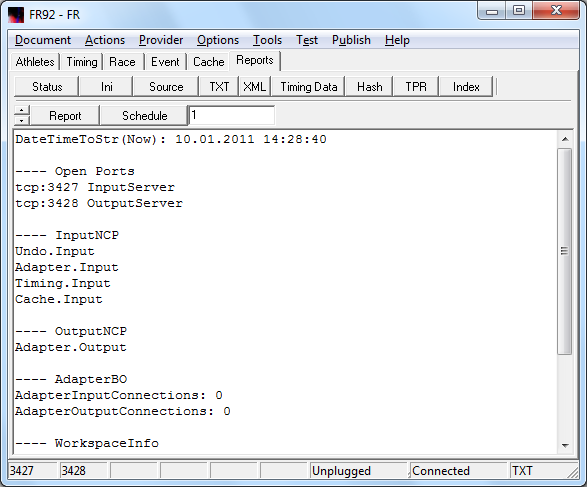
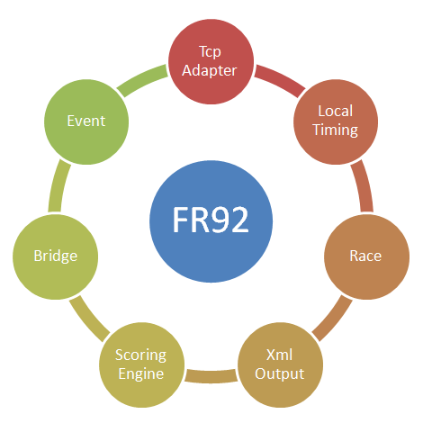
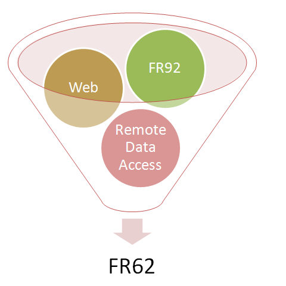



# FR92

FR92 meets the following use cases:

- Viewing of competition data. 
- Local input of entry data. 
- Local input of timing data. 
- Local input of event data. 
- Handling requests from proxy web. 
- Converting data to FR-Xml format. 
- Converting data to FR-Txt format. 
- Processing of network based timing data. 

In contrast to FR62 the following features were removed:

- Home Web 
- Remote Web 
- Silverlight Web 
- Browser Page 
- Event Menu 
- Startup Logger 
- Startup Scenario 
- Remote Data Access 

The following features of FR62 are still available:

- Adapter 
- Switch 
- Bridge 
- WebReceiver 

Driving intent for the FR92 feature cut:

- The program should not carry the overhead of the http interface. 
- The program should only have the original tcp network features.

