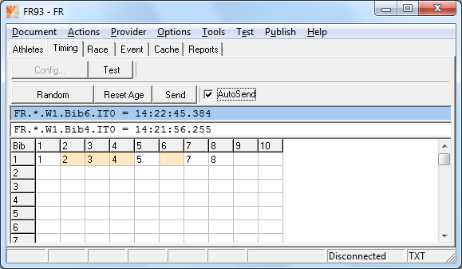
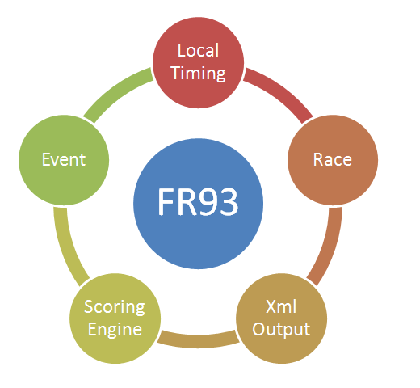



# FR93

FR93 meets the following use cases:
- Viewing of competition data. 
- Local input of timing data. 
- Local input of event data. 
- Converting data to FR-Txt format. 
- Converting data to FR-Xml format. 

In contrast to FR92 the following features were removed:
- Adapter 
- Bridge 

In contrast to FR91 the following feature was removed:
- Bridge 

Driving intent for the FR93 feature cut:
- The program shall only have local features. 

You can import data from a spreadsheet using the clipboard. 
The direct input of data in the grid of table Athletes/Entries, 
Race and Event is also possible.

The data is saved to the workspace on disc. 
The workspace is usually located in the documents folder of the user (folder RiggVar Workspace).

As a final result the xml event data for display on the Silverlight client can be copied out of the application.
