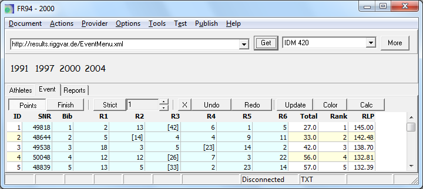
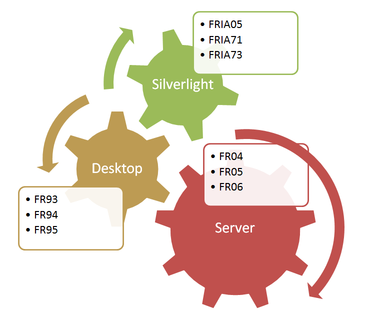



# FR94

FR94 meets the following use cases:
- Viewing of competition data (event part only).
- Download of static event data from the web.
- Local input of event data.
- Converting data to FR-Txt format (from spreadsheet import).

In contrast to FR93 the following features were removed:
- FR-XML output format
- Race part
- internal scoring engine

In contrast to FR93 the following features were added:
- Event Menu

Driving intent for the FR93 feature cut:
- The program should only consist of the event part.
- The default scoring engine shall no longer be built into the program.

The data loaded from the web is in most cases data of finished competitions
where timing data of individual races is not available.
The timing data (intermediate times and finish times) of individual races
may not have been recorded or simply dropped to save space.

FR94 is the desktop alternative to FRIA05.
If the grid of the Silverlight application appears to be slow or displayed too big,
which can be the case on older machines,
hen FR94 should still process the data very fast
and therefore be suitable for *professional* analysis on the notebook.

