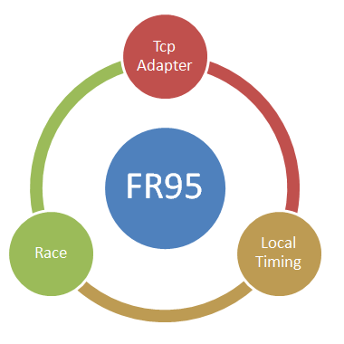



# FR95

FR95 hat folgende Einsatzgebiete:
- Ansicht von Race Daten.
- Manuelle Eingabe von Timing Daten.
- Server für Timing Daten.

Gegenüber FR92 wurden folgende Features entfernt:
- Bridge
- Switch
- Event

Zielstellung für den Zuschnitt von FR95:
- Das Programm soll den Event-Teil nicht mehr enthalten.

In FR95 ist nur noch der Race-Teil enthalten. 
Insofern ist FR95 das Gegenstück zu [FR94](FR94.html), 
wo nur noch der Event-Teil enthalten ist.

Der Einsatz von FR95 konzentriert sich auf das Timing eines Rennens. 
Da der Race-Teil spotartunabhängig ist könnte FR95 theoretisch 
auch für andere Sportarten als Segeln/FleetRace *missbraucht* werden.

Zeiten können mit dem internen Timing Klient manuell erfasst werden. 
Als wichtigster externer Anschluss ist der externe [Timing Client](FR38.html) (Simulator) 
oder natürlich potentiell jeder kompatible reale Timing Provider/Sensor vorgesehen.

