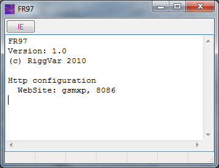
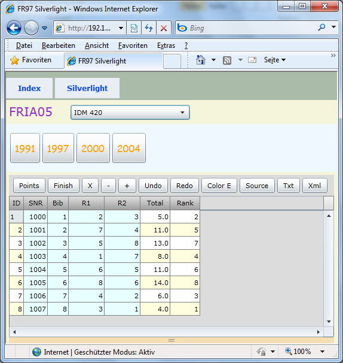
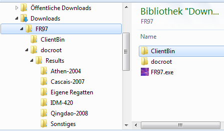



# FR97

## The Server



FR97 beinhaltet einen minimalen Http-Server auf Basis von Indy-TIdHttpServer.

## The Client



Die Website liefert den [Silverlight Client](../silverlight/FRIA05.html) aus.
Damit können Benutzer (im Intranet) nach Belieben auf die Resultate zugreifen und diese in der Browsersession verändern.

## The Data Folder



The data is located in the file system, in a subdirectory of the server application.

The xap file for the Silverlight client (FRIA05.xap) is in folder ClientBin.

EventMenu.xml and the data files are in folder docroot/Results.
EventMenu.xml defines the content of the combo box and menu bar(s) in the Silverlight application.

```
FR97/
    FR97.exe
    ClientBin/
        FRIA05.xap
    docroot/
        Results/
            EventMenu.xml
            Serie01/
                Regatta01.xml
                Regatta02.xml
            Test/
       	        FleetTest.xml
      	        NameTest.xml
            Sonstiges
      	        Meisterschaft.txt
      	        Pokal.txt
```

FR97 is shipped with a set of example data,
which the user can take as a starting point for change.
FR62 is a suitable application for editing/producing the event data xml files.
Xml files can be edited by hand or produced by a tool because they contain only input data.
The calculation of results is always done inside the Silverlight client.
