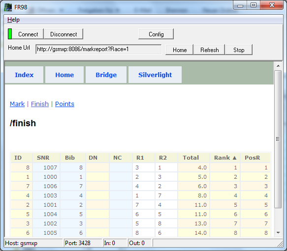



# FR98

No, FR98 is not a stripped down version of FR62.

FR98 is an example of a classical output client.
It connects via tcp to the result server [FR04](FR04.html)| FR62 | FR63 | FR65 | FR93 and retrieves reports.

The reports are usually html reports and can be displayed in the embedded browser control.
New versions of the report can be requested automatically and so the display is updating itself (if something changed).

The Silverlight client FRIA03 can receive the same notifications/messages via tcp as FR98
but FRIA03 computes the results on the client side.
FR98 in contrast to FRIA03 is a thin client that does not generate/compute the reports.

Following the same pattern we can create special customizations;
you only need to come up with the requirements.
Whether the reports are requested via tcp or http does not make a big difference.

If a generic report (xml) is requested derived reports can be created within the output client.
The protocol and format of FR messages is no secret,
you can create a client yourself.
FR98 might be used as a model to start with.
