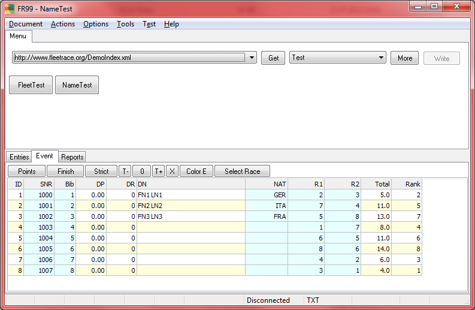



# FR99

## Update 2012

FR99 is comparable to FR01, but it has special features.

The additions include some dialogs for setting up params of the loaded event.
That is why the program is better suited for preparing the initial event data files.
Events prepared with the help of FR99 can be uploaded to the Internet and consumed and appended with FR01 (and other programs).
Within FR99 you will do the real work. An initial set of data can be imported from Excel.
A usual text editor program would do as well.
But using FR99 you can be sure that the generated text output does not contain syntax errors.

The program manages a local workspace in AppData/Local.

FR01 can work with local data on disc too, but you have to configure a Url to the local workspace first.
In contrast to FR01 the one special local workspace of FR99 is built in
and configured per convention
such that is works together in tandem with built in workspace of FR02.

With FR01 the consumption of data is the focus of the application.
FR01 will not store anything on the local disc by default.
Each of the programs has its advantage; the exclusion of features can be seen as an advantage too.
When needed FR99 can be customized,
so that it works together with your server and acts as an optimized tool for those who *prepare* the data for the event.
