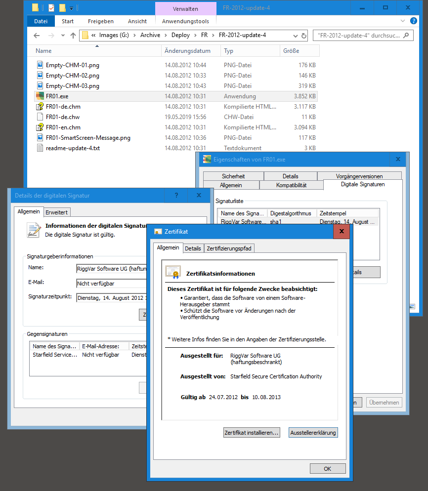

# About FR01 Updates, old updates

This is a pseudo blog post, from 2019-05-21, 05 = May.

- I wanted to add an old *Blog Post*, about Update 2.
- And I wanted to briefly deal with Update 4, because it existed.
- And I have made some small modifications of the [theme](cayman-theme-mods.html).

## Update 2

The new *feature* in Update 2 is the **Read** button on *page Menu*.
You can use it to load/reload text from the **Memo**.
Let the application directly load data you have changed/edited in the Memo control.

Two buttons have been added to *page Report*.
They can be used to toggle between the separator char in csv lists, in the Memo.
The buttons will make it easier to *exchange* data with Excel.

1. Before you copy data out of the Memo for pasting into Excel, you choose (convert to) **Tab** separator.

2. After you have pasted data from Excel into the Memo you change back to using **Semicolon** as a separator.
This is necessary in order to load the data successfully with button Read.

> FR expects csv data to be semicolon separated.

## Update 4

The *last* Update was Update 4, from Juli 2012.

### About readme-update-4.txt

```
#==========================================================================#
# readme for fr01-win32-update-4                                           #
#                                                                          #
#      F                                                                   #
#     * * *                                                                #
#    *   *   G                                                             #
#   *     * *   *                                                          #  
#  E - - - H - - - I                                                       #  
#   *     * *         *                                                    #
#    *   *   *           *                                                 #
#     * *     *             *                                              #
#      D-------A---------------B                                           #
#               *                                                          #
#               (C) RiggVar Software (haftungsbeschränkt)                  #
#                                                                          # 
===========================================================================#

this is an update for FR01.exe

changes in update 4 - build number 1.0.4609.37454
=================================================
- Help file added

- Added batch process for the whole workspace to Tab Cache.
  Tab Cache can save files (xml, html, txt) to folder <User documents>\FR\Cache.
  Tab Cache is hidden by default.
 
changes in update 3 - build number 1.0.4580.50956
=================================================
- Tab Cache added.

- Tab Profile updated.

- Feature to activate hidden/disabled items added.

  The following Items are now invisible/disabled by default:

  Button Clear
  Button Style
  Button More
  Button Write
  Button Read
  Tab Profile
  Tab Mobil
  
- The bottom Memo on page Report (StatusMemo) now supports more keyboard shortcuts.

  Ctrl a - select all
  Ctrl t - replace semicolons by tab
  Ctrl s - replace tabs by semicolon

The Toolbar-Buttons for replacing tabs and semicolons (useful when working with Excel)
have been removed - use the keyboard shortcuts.
```
Ich habe die readme siehe oben etwas gekürzt, die Lizenz Info herausgelöscht, weil nicht mehr relevant, jetzt ist alles GPL 3.0.

### About FR01.exe in Update 4

Update 4 came as zip file and contained the following items, minus the pictures from testing:

*Content of fr01-win32-update-4.zip, after testing, with screenshots of the test.*<br>


The executable file **FR01.exe**, if downloaded with the zip file from the Internet, 
needed to be given *permission to run* by the user.
Instead of inserting more big images of the test run, I will simply list the *transcript* of the dialog window content:

```
Windows protected your PC

Windows SmartScreen prevented an unrecognized app from starting.
Running this app might put your PC at rist.

Publisher: RiggVar Software UG (haftungsbeschrankt)
App: FR01.exe

[Run anyway] [Don't run]
```

> I clicked on **Run anyway**, because I trusted my own program !

### About FR01-de.chm in Update 4

Help file **FR01-de.chm** was unsigned and was showing an empty content area, initially.
The toc listing to the left was present and readable, but the html content in the main area was empty, only a white area was visible.

But the help file could be given permission to run as well, 
with right click, then *properties of file*, and finally with **Open** in another popup dialog window.

```
Open File - Security Warning

Name: C:\Users\UserName\Downloads\Update-4\FR01-de.chm
Publisher: Unknown Publisher
Type: Compiled HTML Help File
From: C:\Users\UserName\Downloads\Update-4\FR01-de.chm

[Open] [Cancel]
```

## MSI Packages

Using an signed `.msi` Installer package would have been *easier*,
and indeed I did create singed installer packages for almost all of the variations of FR, e.g:

- FR38Setup.msi (signed Dienstag, 19. April 2011 15:54:45)
- FR94Setup.msi (signed Mittwoch, 1. Juni 2011 08:14:15)

## Windows Store

Today it is recommended to create `.appx` packages for the applications and publish them in the Microsoft Store,
with Microsoft checking and signing the App for distribution.

Then the application can be installed at the new default location, somewhere, it is possible to find where exactly.
This makes a lot of sense.

## Fazit

> Compile yourself.

Other than that there are open questions, among those the question of overall effort/complexity,
and the question regarding flexibility.

It can seem to make sense to:
- create a folder in `D:\Fleetrace\`
- unpack a zip file with FR01 in this location
- perhaps even together with some example data files

The help text is now here.

> [Angular FR](../angular/FREO.html) is the new FR01, which you do not need to install.

With FR69 the matter is more complex, because of configuration, because of listening sockets, and maybe more.

[Back to blog index](blog-index.html)