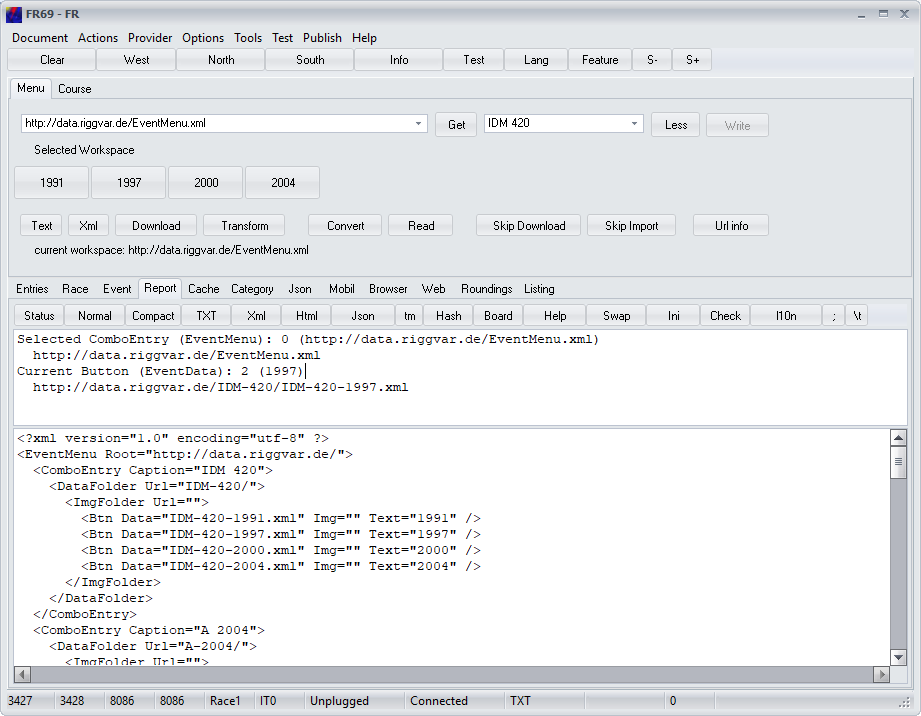

# More or Less

On page Menu you can toggle the mode between More and Less.

In mode More - when the button caption reads **Less** - you see *additional* buttons. 
These buttons are useful if you are setting up a new workspace or a new event.

### Buttons related to working `EventMenu.xml` xml

**Text**: This button creates the transformed version of the example EventMenu.xml. 
The Transform button must produce the same output, 
if the xml example was loaded into the Memo before.

**Xml**: This button will load the example EventMenu.xml into the Memo.

**Download**: This button will load EventMenu.xml (can be named differently) 
from the source selected in the top left combo. 
The result will appear in the Memo.

**Transform**: This button will transform EventMenu.xml from the Memo. 
The program will always process the transformed version. 
The Transform button can be used to find errors in EventMenu.xml.

### Buttons for working with `EventData.*` text

**Convert**: The Convert button does not work with EventMenu.xml, 
but with EventData.*. EventData.* can be present in form of Text, Xml or Html. 
The Convert button converts the event data, if necessary, 
and writes the result into the Memo.

**Read**: This button reads data out of the Memo and loads data into the application.

### Memo controls

The upper Memo control is the *Test Memo* which will show you some helpful output.

The lower Memo control is the multiline edit control on page Report you can use for editing data.

Even when using a writable local workspace you can avoid a hard disc round trip just by

1. writing output into the Memo control,
2. modifying the Memo text and 
3. loading again with a button click.

Also note:
 - With the help of mode **More** and button **Read** you can view and edit text data 
   downloaded from the Internet *before* it is loaded into the application.
- You can edit parameters and properties for which there is no graphical user interface included in the application.
- It works with a read only workspace like a location on the web.
- **Skip Download** and **Skip Import** in the image above will toggle options that are evaluated only in mode **More**.
- Button **Url info** in the image above will print info to the upper Memo control related to 
  - the category combo box item last selected (the current item)
  - and and the last clicked event button if any (the current event) 

