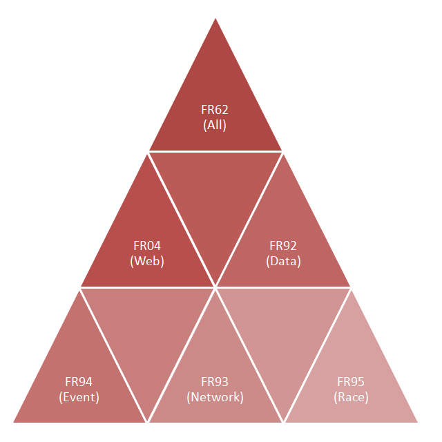

# Components

Project FR includes normal desktop applications, server processes, timing clients, web applications and Silverlight clients.

Old: The Silverlight client for the FleetRace project is also called the FleetRace Internet Application (FRIA). There are several (active and passive) variations of the Silverlight client.

Old: The Silverlight client as the last part in the chain can be used standalone for the display of static results of a regatta. Static means that the input data is simply placed as a file on a web server. Within the Silverlight client however the results are computed dynamically and can be changed long after the event happened, see demo. The Silverlight client can be licensed for use on the web site of your sailing club or class association. For everyone who is interested in providing results we have assembled a quick start guide.

## List of Components

[**FR04**](applications/FR04.html)
Result server, minified variation, does not save to disc, without configuration, with fixed scenario (bridge server for FRIA). 

[**FR38**](applications/FR38.html)
Timing client, sends single line messages. 

[**FR62**](applications/FR62.html)
Result server, full featured, with scenario manager for configurations free operation. Integrated website can replace tcp input client and tcp output client. 

[**FR63**](applications/FR63.html)
Like FR62, but graphical UI is empty. This program can be used when no operator is sitting on the computer. You are using the server functionality of the program exclusively. The server process is controlled over a web interface (browser). 

**FR64**
FR as web application. Depending on the platform it is implemented as ASP.NET generic handler, Java servlet or (historically) a Delphi ISAPI dll. This  application is available for special use cases only. It is recommended to start with the desktop application. 

**FR65**
Like FR63, but as Windows service. 

**FR66**
FR66 is a desktop application with a built in proxy website and a socket connection to any FR stateful server application. 

[**FR91**](applications/FR91.html)
FR93 plus Bridge or FR92 minus Adapter, Switch and ServerBridge. 

[**FR92**](applications/FR92.html)
FR62 minus Web. 

[**FR93**](applications/FR93.html)
FR91 minus Bridge. This program is a standalone desktop application. The feature of automatic synchronization of data with pears has been removed from FR93. 

[**FR94**](applications/FR94.html)
FR93 minus Race, plus EventMenu Only the sports specific event part was not removed from the program. This program can be used for import and processing of  spreadsheet data. 

[**FR95**](applications/FR95.html)
FR62 minus Event, Switch, Bridge, Cache, Browser und Output. All sports specific parts have been removed from the program. The leftover is the sports independent race part only. This program can be used for many standard timing tasks. 

[**FR97**](applications/FR97.html)
An application with TIdHttpServer, a minimal ad hoc web server serving FRIA clients und xml. 

[**FR98**](applications/FR98.html)
A traditional output client. It will be notified (receive messages), and it will request reports. 

**FRWA01**
A dynamic website, based on ASP.NET MVC, it serves FRIA clients over http, it retrieves archived data for FRIA from a database. 

**FRWA02**
A static website, servers FRIA clients, reads xml for FRIA off the file system. 

**FRWA03**
Silverlight RIA, shows an event page, is manually connected with result server. 

[**FRIA05**](silverlight/FRIA05.html)
Silverlight RIA, with event page, designed for download of static data. It can be integrated in a plain html website. 

[**FRIA11**](silverlight/FRIA11.html)
Silverlight RIA, it shows a race page and is manually connects to a result server. 
