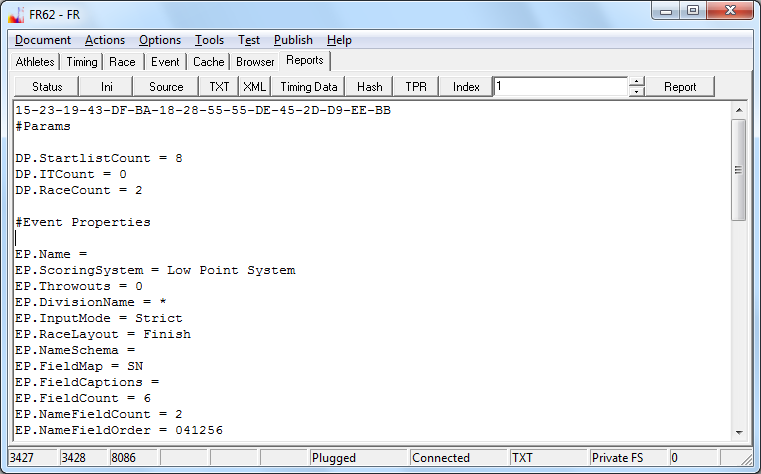

# FR-XML export guide

It is not difficult to provide data in a format that can be read by the FR programs.
Data can be provided in text and xml format.
The Utf-8 encoded Xml is the preferred data exchange format.

In general, the data file consists of a number of tables: the start list,
the fleet list, the list of athlete/entry names,
the list of finish positions and the list of penalty assignments.

If the races are timed races,
there will be an additional number of tables holding time point data.
These timed races usually account for the most space in the file.

The result examples will answer most questions, how the tables should be written out to the file.

Using the TXT button on page Reports in the program you can always generate an excerpt of the event data.
The Xml version contains the same information.

The first line in the memo output is a hash over the computed results,
which can be used to compare results more efficiently.
This line is not saved to disc.
Lines starting with a # character are comments and can be ignored.



Following is a complete copy of the standard event data text, which is loaded by default when the program starts:
```
#Params

DP.StartlistCount = 8
DP.ITCount = 0
DP.RaceCount = 2

#Event Properties

EP.Name =
EP.ScoringSystem = Low Point System
EP.Throwouts = 0
EP.DivisionName = *
EP.InputMode = Strict
EP.RaceLayout = Finish
EP.NameSchema =
EP.FieldMap = SN
EP.FieldCaptions =
EP.FieldCount = 6
EP.NameFieldCount = 2
EP.NameFieldOrder = 041256
EP.UseFleets = False
EP.TargetFleetSize = 8
EP.FirstFinalRace = 20
EP.IsTimed = False
EP.UseCompactFormat = True

NameList.Begin
NameList.End

StartList.Begin
Pos;SNR;Bib
1;1000;1
2;1001;2
3;1002;3
4;1003;4
5;1004;5
6;1005;6
7;1006;7
8;1007;8
StartList.End

FinishList.Begin
SNR;Bib;R1;R2
1000;1;2;3
1001;2;7;4
1002;3;5;8
1003;4;1;7
1004;5;6;5
1005;6;8;6
1006;7;4;2
1007;8;3;1
FinishList.End

#W1

#W2

EP.IM = Strict
```

Underneath the comments #W1 and #W2 one would list the penalty assignments,
if any. Line EP.IM = Strict is an instruction to the program,
meaning that it should try to switch to [strict input mode](doc-input-mode.html) at the end of reading data from the stream of text.
The listings between lines *.Begin und *.End can be copied directly from a spreadsheet.
These lists are given in the compact text format.
You can read more about the compact text format in the [message example](doc-msg-example.html) article.

The parameters of the event must appear first in the file, so that they are read first by the program.
Using the parameter values, the program will prepare the right amount of memory for the data that follows.

```
#Params

DP.StartlistCount = 8
DP.ITCount = 0
DP.RaceCount = 2
```

RaceCount defines the count of races in the event.
ITCount defines the count of intermediate time points in a race and is used in all races of the event.
StartlistCount defines the count of entries in the event, and this is also used in all races of the event.
The count of lines in the lookup table of the entry names can grow as needed and is not specified by a parameter.

In the following paragraphs I will explain the properties of the event,
which precede the listing of tabular data.
This is also the place where you could fine tune the display of data.

```
#Event Properties

EP.Name =
EP.ScoringSystem = Low Point System
EP.Throwouts = 0
EP.DivisionName = *
EP.InputMode = Strict
EP.RaceLayout = Finish
EP.NameSchema =
EP.FieldMap = SN
EP.FieldCaptions =
EP.FieldCount = 6
EP.NameFieldCount = 2
EP.NameFieldOrder = 041256
EP.UseFleets = False
EP.TargetFleetSize = 8
EP.FirstFinalRace = 20
EP.IsTimed = False
EP.UseCompactFormat = True
```

The event properties (EP) are the properties that must be saved with the Event. There are several of them:

<dl>
<dt>EP.Name</dt>
<dd>Holds the name of the event. I does not effect computation of results but may be displayed on reports.</dd>

<dt>EP.ScoringSystem</dt>
<dd>This property may be used to select the scoring system.
What scoring systems are available depends on the scoring engine used.
The default scoring engine recognizes the values 'Low Point System', 'Bonus System' and 'Bonus System DSV'.</dd>

<dt>EP.Throwouts</dt>
<dd>Contains the information, how many race results the scoring system should discard.</dd>

<dt>EP.DivisionName</dt>
<dd>The division is the second compartment in the message definition.
Use * if in doubt.
The value of * stands for anonymous (wildcard) division.
Messages for the anonymous division are always accepted.
Otherwise messages are only accepted, if they are targeted for the division specified.
The division is meant to correspond to a class of boat, but should not contain special characters.
For the purpose of data import * is a good choice.</dd>

<dt>EP.InputMode</dt>
<dd>When data is written out to a file, the current use of the input mode is saved using this property.
It can be ignored for the purpose of importing data.</dd>

<dt>EP.RaceLayout</dt>
<dd>RaceLayout saves the current choice of values Finish or Points, which control what is displayed in the cells of the event grid.
When data is written out to a file, the program will save the current state in this property.
The property value can be ignored when exporting/importing data.</dd>

<dt>EP.NameSchema</dt>
<dd>Used to specify NX or Default Schema. Schema NX would refer to the name columns as N1, N2, and so forth.
Default schema uses FN,LN,SN,NC,GR,PB for name columns.
The schema is used when data is written out to a file.
For the purpose of importing data you should use schema NX.</dd>

<dt>EP.FieldMap</dt>
<dd>There is a virtual column DN (display name).
With property FieldMap you can specify what values should be projected into this column.
See the article about names.</dd>

<dt>EP.FieldCaptions</dt>
<dd>With the FieldCaptions property you can override the default captions of the name columns.
The order of the names given in the comma separated list must correspond to column order specified in property NameFieldOrder.
The first caption in the list is the caption for the column that appears first on the report.
Normally the number of items in the list should match the NameFieldCount property.</dd>

<dt>EP.FieldCount</dt>
<dd>This specifies the number of columns available.
Use this property if the number of name columns shall be greater than six which is the default.
Data for columns that are not available will be ignored.</dd>

<dt>EP.NameFieldCount</dt>
<dd>This specifies the number of name columns to appear on the reports.</dd>

<dt>EP.NameFieldOrder</dt>
<dd>This property specifies what columns are to be included on the reports and in what order.
What looks like a number is a list of digits without separator.
The count of items in the list is expected to match the NameFieldCount property.
See the article about [names](doc-entry-names).
The digits are evaluated as the index of a column.
The display name column (DN) is at Index 0.
All other columns have index X, corresponding to the column identifier NX.</dd>

<dt>EP.UseFleets</dt>
<dd>This property defines if groups are used for the event.
If so, a table/matrix of fleet assignment information is expected later in the file.</dd>

<dt>EP.TargetFleetSize</dt>
<dd>This is meaningful only if the UseFleets property is True.
Is defines the size of a group in the qualification races.
This value is provided to the scoring engine.
I recommend to specify the default number of 8 if no groups are used.</dd>

<dt>EP.FirstFinalRace</dt>
<dd>The property is also provided to the scoring engine.
I recommend to specify the default number of 20 if no groups are used.</dd>

<dt>EP.IsTimed</dt>
<dd>If this property is set to False, no race timing data tables are stored in the result data file.
When the event is a timed event the property must be set to True, otherwise split times would not be persisted.</dd>

<dt>EP.UseCompactFormat</dt>
<dd>This property designates the file format variant.
It must be True if the event file is to use compact text format.
Some of the event properties only appear in the file, if they do not match the standard value.
This is the case with event metadata other than the event name (date, place),
special options in regard to the reports (ShowCupColumn) and parameters for the one and only other special built in calculated column (Ranglisten-Berechnung).
These properties can be ignored for the purpose of data transfer.
The properties can be set within the graphical UI of the program, and will then appear in the text/xml file.</dd>

The data type of the properties (boolean, numeric/integer, string) can be inferred by looking at the examples.
The value of boolean fields is written out as True or False, and internally we will in most cases look for the T in True.
If in doubt, please specify the values in the same way as written by the program.</dd>
</dl>

A list of optional values is given below:

<dl>
<dt>EP.ShowPosRColumn</dt>
<dd>PosR is the column that holds the unique ranking with guaranteed resolution of any tiebreaks.
Tiebreak resolution may be done independently of the scoring engine.
The display of this column should be suppressed in almost all cases.
Sometimes it is used to sort by points while ignoring groups.</dd>

<dt>EP.ShowCupColumn</dt>
<dd>This property controls the display of the column for 'Ranglistenpunkte'.
Should be suppressed in most cases.
See this as a placeholder for the potential case of someone wanting one column with a special calculated result.</dd>

<dt>EP.ScoringSystem2</dt>
<dd>This property can have a number as value.
The numeric value is passed on to the scoring engine which can then use it to decide which scoring system to use.
We do not know at this time what scoring systems might be supported in the future.</dd>
</dl>