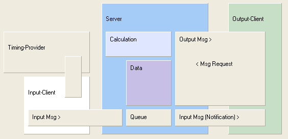

# Message Flow

The picture shows the message flow in the system.
The server (light blue) shall have two server sockets (one to the left and one to the right).
Input client and output client have one client socket respectively and connect manually to the server.
A typical scenario is given below which starts with a single line messages (top left):

- The timing provider (sensor) sends a message in its own format.
  These messages need to be converted.
  In order to do this an extra external adapter is introduced.
- The server receives a single line messages from input client.
  These messages are encoded in the system defined format.
- The server validates the messages, ignores invalid messages.
- The content of valid messages is stored (Data), messages are added to the Queue.
  The Cache (for reports, optional, not shown) is marked as invalid.
- The server can evaluate more messages now.
- When the server has finished that task (going idle) the show goes on.
  The system state is refreshed/newly computed (if necessary), then the Queue is processed.
- Processing the Queue means that all queued single line messages are passed on to all clients connected to output (right).
  Thereby output clients receive exactly the same messages as the server itself.
- Often a output client will not completely evaluate the (short) messages.
  It will simply assume that something changed and it will request an current version of the report that is currently displayed. (MsgRequest)
- The server will answer the request by generating the report and sending it back.
  The report will also be stored in the Cache.
- Future requests for exactly this report may not be computed again but taken directly from the Cache.

Because single line messages received at input side are passed on unchanged
to potentially several connected clients
a tree like/cascading network of (identical) servers can be established
with the help of a server coupler component.
(The server coupler has two client sockets and sends everything to the output that has been received at input.)
Make sure no feedback is introduced, e.g. by connecting to the wrong socket.

In the usual case a Switch or Bridge component is used to connect servers.

A Switch makes use of the normal input and output socket.
A Switch implementation is available as a Delphi application (also in the form of a Windows Service).

In contrast, there is a whole hierarchy of implementations of the Bridge concept.
The server application always uses a client socket (tcp or http or internal) in order to establish a connection to the Bridge.

It is possible to receive multi line messages at the server input socket.
These multi line messages are not passed on to clients.
The normal use of a multi line message is a list of input messages.

A message at input side can be prepended by one or more request (of report/output).
This makes a Request/Response pattern possible through the input socket.
But input messages can only be sent to the input socket,
input messages are not processed when sent to the output socket.
