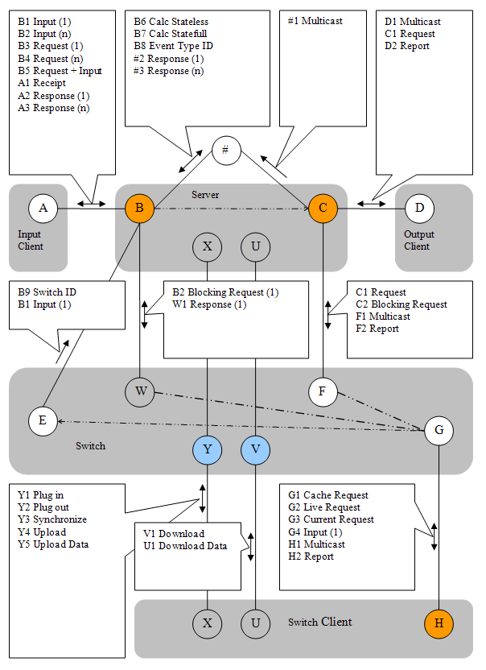

# Message Map

## The picture of the message map

The following picture describes the messages between input client, 
server application and output client. 
It is the main axis of the message traffic. 

Also shown in the picture are internal connections (marked with #).

Points B and C are abstract connection points. 
In reality there are external and internal connection points. 
There is a *Switch* between the internal and external points (operations Connect/Disconnect). 
In status Disconnected the server ignores external traffic.

Shown below the *main axis* is the Switch application. 
With the help of the Switch application server data can be synchronized between servers
and Switch clients can be connected indirectly.

Similar to using the Switch two servers can be synchronized via a Bridge.
Bridge connections are not shown in the picture.
Because of the reversed initiative when establishing connections using the Bridge does not normally make firewall settings necessary.
Silverlight applications are connected via a Bridge.

Messages can be sent via a website that may be embedded into the server application.
This applies to input messages (Ajax), requests of reports and control messages.
The internal Bridge/Website is attached via internal connection points B and C. 
External connection points B, C and H are in all cases TCP server sockets (orange). 
Point V (Switch) is a Http connection point.



## Connection AB
- B1 in the top left box means that a message can be sent from A to B. 
- The Character designates the target. 
- The origin can be determined by the connecting line. 
- The digit following the character designates the different cases.
- **B1 Input (1)** - a single line message can be set from Input to Server. 
- **B2 Input (n)** - the Server can receive multi line messages from Input. 
- **B3 Request (1)** - the message contains a single Request. 
- **B4 Request (n)** - the message contains a multiple Request (n-time).
- **B5 Request + Input** - in addition to input the message contains at least one Request.
- **A1 Receipt** - designates an optional acknowledgement for a single line message.
- **A2 Response** - designates the answer to a single Request (with and without attached Input)
- **A3 Response (n)** - designates the composed answer (xml CDATA) to a multiple Request at Input.

# Connection CD

- **D1 Multicast** - every single line message from Input is passed on to all connected systems at Output.
This happens after processing and computation (using the internal Message Queue). 
- **C1 Request** - an Output client requests a Report at connection point C (server output socket) which is generated and sent back without delay.
- **D2 Report** - a previously requested Report is reaching client socket D of the Output application. 

## Connection #B

- **B6 Calc Stateless** - A multi line message sent via an internal connection to Input B.
Contains a complete set of event data, identical to a Backup.
Also contains one or more requests of a report.
The primary application object (BO) is recreated and destroyed after the method call (Calc).
This is a typical case in a web application.
But it is also the case with a stateless Test/Calc server.
- **B7 Calc Stateful** - A multi line message sent via an internal connection to Input B.
Contains a request of a report.
The BO is not recreated; the status of the BO is maintained. 
- **B8 Event Type ID** - marks an internal connection with the Event-Type-ID.
This is meaningful in a Multi-Event-Type-Server that uses a preview/front side message router.
By marking the connection point it is possible to route messages via the correct internal connection,
i.e. sending the message for processing to the right type of BO.
Every BO has connection points B and C.
- **#2 Response (1)** - like A2, only via internal connection
- **#3 Response (n)** - like A3, only via internal connection

## Connection C#

- **#1 Multicast** - stands for a message multicast via internal connection. # designates internal connections. 
For example, internal connections are used where input and/or output clients are integrated into the server application.

## Connection XY

In the picture there are two XY connections, one originating from the server, 
and one more originating from the Switch Client. 
The box is drawn close to the bottom connection (from Switch Client),
but it is valid for both drawn connections.

The Switch with Http end points Y and V does not have TCP server sockets.
Instead it has TCP client sockets.
For example there can be on instance of the shown Client Socket E or multiple instances.
Whereby the connections can go to the same server or to different instances of the server application.
Imagine the Switch as a table with rows (entries).
Each row will specify a connection. You can add rows or remove rows.
The Switch mediates between two applications,
that both have listening sockets (server sockets) open,
and therefor cannot connected directly.

- **Y1 Plugin** - a Switch client requests that one or two connections be established.
For that a connection point Y is used, which is opened by the Switch at program start.
Following that the Switch will connect to point EB and/or FC, 
as requested, in the case of a server issuing the request.
In the case of a Switch client the connection GH is established.
In all cases normal socket connections are used to connect to the partner.
- **Y2 Plugout** - Reversal of operation Plugin, the Switch will close the connections.
A Switch client should close the connection at program end automatically.
Normally closing the connection is a manual action (e.g. available via the main menu).
- **Y3 Synchronize** - If the Switch uses a built in Cache all reports held in the Cache are marked as invalid (Age+1).
This may trigger a automatic update cycle. 
- **Y4 Upload** - Notice of an Uploads, messages Y5 is immediately following.
In the Switch a flag is set, so that the following message is stored as a Backup.
This is in deviation from the normal mode of operation. 
- **Y5 Upload Data** - Transmission of a Backup for storage in memory of the Switch application.

## Verbindung UV

- **V1 Download** - Request of a Download. 
- **U1 Download Data** - the response, that is the combination of stored Backup and Log.
Depending on the type of Event the Log can automatically be compressed using a merge function
such that only the last message of the respective address is left in the Log.

## Verbindung GH

- **G1 Cache Request** - the Switch client requests a Report which should come from the Cache built into the Switch. 
- **G2 Live Request** - the Switch client requests a Report that should be passed on to a Server if possible.
If a Cache is available it is not used.
If several Servers are attached to the Switch the Server marked as Master will receive the Request.
If no Server is marked as Master a target Server is automatically selected using a simple algorithm. 
- **G3 Current Request** - the request with the notion that a Report is taken from the Cache only if the Report in the Cache is marked as current.
Otherwise the request of report is processed synchronously by a Server. 
- **G4 Input (1)** - a single line Input is passed from Switch Input client to the Switch which will pass the message via point E to a Server.
The selection of the destination Server follows the same procedure as with message G2.
- **H1 Multicast** - a multicast message reaches a Switch output client. 
- **H2 Report** - a requested Report reaches the Switch client. 

The message F1 to the Switch is passed on to all Switch output clients, via point H.
A Switch connection GH is either marked as Input or Output.
Only the Outputs receive multicast messages.
An Output client connected to the Switch is acting exactly like a normal Output client connected to point C.
It is only the type of socket (client or server) and the initiative at establishing a connection that is reversed.
While Switch clients can only be indirectly connected they can retrieve reports from the Cache.

## Verbindung WB

- **B2 Blocking Request (1)** - a request G2 or G3 can be issued to a server by the Switch with the help of a blocking request B2. 
- **W1 Response (1)** - the response to B2. Because of the blocking nature it is easy to deliver the answer back to the requesting Switch output client.
The response is stored in the Cache too.
Normally the Cache is populated using asynchronous Requests via point E. 

## Verbindung FC

- **C1 Request** - a passed on Request from point G, see C2. 
- **C2 Blocking Request** - It is left to the Switch implementation whether it is implementing requests from point G as a C1 or C2 message. 
- **F1 Multicast** - single line message which was passed on by a Server using multicast at the output socket. 
- **F2 Report** - the answer is arriving with a previously requested report. 

```
That's all.
```

[Back](doc-index.html) to the the docs.