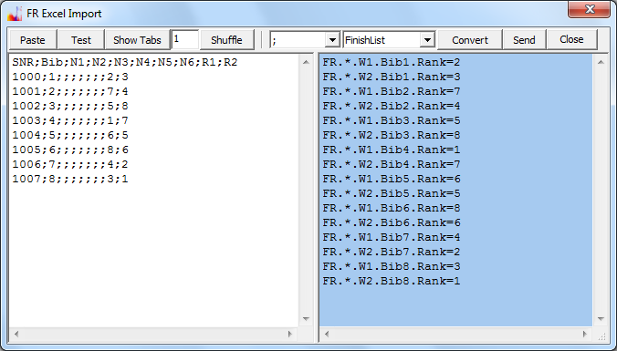

# Spreadsheet Support

## Description of task

You have got the program (FR desktop application) and the spreadsheet program (Excel).
Now you want to prepare the input data within the spreadsheet and then copy it to the program.

This article describes, how you can import tabular data of the start list,
the assignment of fleet membership, the names of athletes,
penalty assignments and of course the finish positions.

The import of intermediate (split) times (mark roundings) of a single race is not detailed here.
The split times are normally provided online by the timing provider
and there are better options of consuming this type of data than copying from a spreadsheet.

## General process

The program can not only import, but also export data via the clipboard.
You could adjust the number of races and the number of name columns in the program first,
and then export data using a menu item.
The data copied to the clipboard can then be pasted into Excel.
Now you have sort of a template which you can start to fill in.
As an alternative you could download an example Excel file and use that as a starting point.

If you do not use a template, everything is still easy,
you only have to know what is important:

1. Convention over configuration: The spelling of text in the column headers must be exactly as expected by the program.
There is no special adjustment dialog, the naming of the columns must be according to the specification.
But updating the header column is quick in Excel and also done quickly in the memo field of the standard import dialog of the program, see below.
2. Convention over configuration, again: The order of the columns matters.
When converting data, single line messages are generated to represent information in a cell.
The program will send these messages later to itself via an internal connection.
In order to keep the complexity of the task low,
information needed to identify the storage location of the values must be given first,
so that messages can be created without a second pass.
Example: Key fields SNR or Bib must precede the value fields RX of finish positions.
3. Values in a cell must use the vocabulary of the program.
With the finish positions it is easy, these are whole numbers.
With the names it is also easy, these are usually taken unchanged.
(The current program supports Unicode.)
Only when specifying penalty values you have to know how to format them correctly.
Here the program follows a convention established by open source software.

## Details

### Formatting of penalty values

FR programs can potentially use different scoring modules.
The scoring module (scoring engine) is replaceable.
It is our intention to provide a scoring engine as open source code,
so that it it can be checked, improved and updated as necessary.

The planning in regard to the list of possible penalty assignments
need to be tailored towards the scoring module used or to the currently valid rules.
The amount of information stored must also be adjusted according to the requirements of the candidate scoring engines.
As mentioned, RiggVar Software intends to support an open source scoring engine,
and this is why we have looked into the open source JavaScore project
for any convention of how penalties should be stored and encoded.

As a general minimum, values dns, dnf and dsq are supported.
The formatting of other penalty values follows the JavaScore convention as far as possible.
Please see the result examples, which are given in Xml and Text format.

### Fleet membership

FR claims to support all features required to score an official Fleetrace type Olympic class regatta.
It includes racing in fleets as well as the medal race.
What the program will intentionally not do because of frequently changing requirements
is the evaluation of the fleet membership itself.

Fleet membership is specified within the program by an integer number,
attached to each cell in the event grid.
The participants in the medal race will have a fleet number of zero.
All other defined fleets are labeled with ascending numbers,
starting from one. The matrix of fleet membership can be given as a table.
This is always an extra table,
where the column headers used are the same as with the matrix of finish positions.

When fleets are used, data should be imported in several steps.
Import the start list first, then the definition of fleet membership,
then the finish positions and penalty values.
Make sure you have the fleet membership specified before you try to switch over to [strict input mode](doc-input-mode.html).
The [names of athletes](doc-entry-names.html) can be imported at any time.

The option to perform a what-if-analysis is lost in part when using fleets,
because it does not make sense to change data of an already completed group phase.
Anyway, FR supports fleets.
In order to avoid the need to manually input fleet membership information into the FR program,
this info can be imported from Excel for one or more races via the clipboard.

From my point of view it makes sense to insert spreadsheet data directly into the text file of the event,
which is then opened by FR.
Should you only want to copy the fleet membership assignment from one race over to the next,
this can simply be done using a menu item of the program.
The fleet membership assignment can also be input interactively for each cell in the grid.
To make it visible you select the Color F coloring mode,
which will cause painting the background of the cells to show fleets.

### Dialog

Having dealt with the penalty and fleet topics briefly,
I can now focus on the core of the import business. But look on the picture first.

Here is how you would use the import dialog:

- Select and copy the table in Excel including the column headers.
- Insert the data into the white memo on the left side using the Paste button or Control V.
- Alternatively you could use the Test button to insert test data for testing.
- Press the Show Tabs button if data was delimited by Excel using tabs, which is usually the case.
All tabs will then be replaced by a semicolon,
so that we do no longer have invisible characters.
- The Shuffle button is used to reduce the number of lines.
Input a 2 in the edit field to the left of the button in order to cut the number of lines by half.
You will end up with less but longer lines.
This can sometimes be the easiest way to deal with a multi line layout in the Excel table.
- You can edit the data in the memo, e.g. you can correct the column header labels.
- Select the character delimiting the fields, here the semicolon, in the combo box
- Choose what you want to import, here only the FinishList.
- Press the Convert button to create the list of single line messages.
- Now you can edit the messages in the blue memo, e.g. delete lines.
- Use the Send button to send the messages for processing by the program.
- Activate Close button to close the dialog, no matter if you have sent the messages in the blue memo or not.
- If you open the dialog again, the data is still there,
and you can send the same data again, this is sometimes useful for testing things out.

Using the two editable memo fields and the text based,
message oriented concept of operation,
the import process becomes quite flexible.
You can always insert a prepared set of messages into the blue memo
and use the Send button to pass data to the program via an internal connection.
Or you can send messages over the network using one of the programs in system FR.
Or you add/insert messages to the text file on disc.
The effect is always the same. The program internally uses the same,
robust parser to evaluate the input.
You can read more about the definition of messages in the [message example](doc-msg-example.html) topic.

## Summary

By converting tabular spreadsheet data into a list of single line messages,
the import of data becomes flexible and robust.
RiggVar Software as a business provides solutions for transmission of data.
We care about making programs fully networked. Calculated fields do not need to be imported.
The value of these fields will be computed by the scoring engine.
The concrete implementation of the scoring engine is not a core part of our offering.
A usable implementation can be supplied when needed as a replaceable,
independently updatable open source component.
The implementation of the scoring engine may have special requirements
that effect the definition and formatting of penalty values in the host program.
The general operation of the import feature described in this article will remain unchanged.