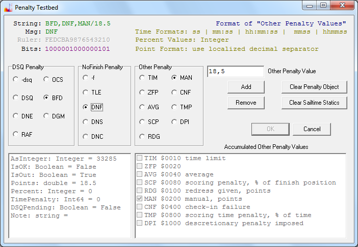

# Supported Penalties

The following picture can be used to get an overview
over the possible scoring penalty assignments implemented in the FR program.

The list of supported penalties and the formatting used was designed to be as far as possible compatible
to the model used in the Open Source Project JavaScore.
Therefore it should be possible for the host program to write an xml file with input data
that can be read by the JavaScore scoring program.

You can use the [FR](../applications/F.html) system to collect timing data from the timing provider,
and then perform the calculation of results within the JavaScore program.

With the help of the dialog you can for the purpose of testing
explore any combination of penalty assignments for a participant of a race
and read out the formatted value from the String label on the top left.
This value would have to appear to the right of the equal sign in a penalty assignment [message](doc-msg-example.html).

The formatting of the penalties is also used for direct manual input into a cell of the grid on page event of the program.
You can input OK in order to delete a penalty assignment for a cell.
Prepending a minus sign would clear a DSQ penalty or a so called NoFinish penalty,
without touching a point, time or percent penalty that may be present.
Combined penalties are rare. This is why you only have to remember the OK.
After clearing the old value, you simply input the new one.
Note that value is separated with a slash when you input a manual points penalty.
Small/lower case characters can also be used.

The formatting convention is the same when importing data from a [spreadsheet](doc-spreadsheet-use.html).

If you edit a text file,
you would separate the decimal digits using a full stop (the locale independent form).
When you work in the graphical UI (grid),
you would use the normal localized decimal separator.

What penalty combinations are valid is dictated by the rule book and/or the scoring engine used
and is not detailed here on this page.

Finally, a thought on scope.
The penalties described here are scoped to the calculation of event results (series scoring).
The event part of the program is sport specific.
The race part of the program is not sport specific and only uses the three generic penalty values: dns, dnf und dsq.
The special penalty values always have to be input into the event part.
You should of course enter dnf or dns in the race part of the program as soon as the fact becomes known.
These values will appear in the event part,
so that the committee only needs to update the special cases in the event grid.
This could be done from inside the protest hearing room.
When online, a message would be sent as soon as you press Enter in the grid cell of the event.
How far the message will travel depends on your setup,
but for now it is guaranteed to stay on the planet.
