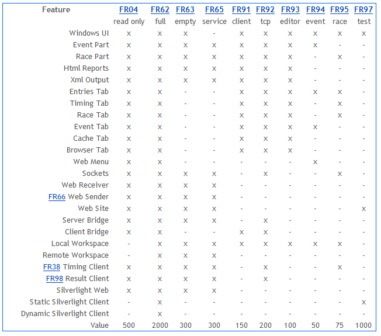
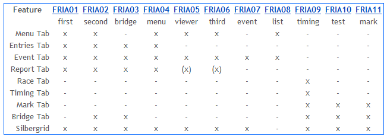

# FR Feature Matrix

This is from 2012.

## FRIA Feature Matrix

FRIA was used to name the FR Silverlight applications.

> Fleet Race Internet Application !!! Wow. (2012)

The core features of the desktop application were also present in FRIA.

The Event Viewer application FRIA05 was/is available online with some test data.

> It is only getting better. (2019)

## Glossary

<dl>
<dt>Windows UI</dt> 
<dd>The feature matrix shows Delphi versions, not the .net and java versions.
With the exception of FR65 (Windows Service) all applications have a normal graphical User Interface.</dd>

<dt>Event Part</dt>
<dd>The Event part of the program is dealing with the sport specific series scoring of several races.</dd>

<dt>Race Part</dt>
<dd>The Race part of the program is dealing with the generic timing of a single race.</dd>

<dt>Html Reports</dt>
<dd>The FR application can generate tables (Entries, Race, Event) as Html reports.
The Html reports may be buffered in the cache and served via tcp (sockets) and/or http (website).</dd>

<dt>Xml Output</dt>
<dd>Xml reports can be used as data source for special externally generated reports.</dd>

<dt>Entries Tab</dt>
<dd>Display of the entries table data showing the athlete/entry names.</dd>

<dt>Timing Tab</dt>
<dd>Simple and easy to use graphical user interface for input/generation of times/timing messages.
Always sends data for the current time point in the current race.</dd>

<dt>Race Tab</dt>
<dd>Grid for display of timing data for a time point in a race.
The user can select the current race and time point.
The tabular display has columns for time behind and rank.</dd>

<dt>Event Tab</dt> 
<dd>Grid for display of the series results of the regatta.
The tabular display has one column for each race with optional content of finish position or assigned points,
as well as columns for computed overall series points and the series rank.</dd>

<dt>Cache Tab</dt>
<dd>The Cache tab contains a grid with a list of defined reports.
The columns of the grid show the report properties, e.g. request string, time of last update and version.
With the buttons you can mark the cache as invalid and start a new update cycle.</dd>

<dt>Browser Tab</dt>
<dd>The browser tab contains the ActiveX-web-browser-control (the embedded Internet Explorer window) 
and tool buttons that are used to browse to the application itself (the embedded or proxied website).</dd>

<dt>Web Menu</dt>
<dd>The web menu is a graphical UI used to download event data via the web (http).
It contains a combo box to select/edit the Url, a combo box for selecting the category,
and a dynamic button bar for downloading the event data (Text/Xml) itself.</dd>

<dt>Sockets</dt>
<dd>Two TCP-Server-Sockets, Input and Output, for message exchange over the network.
Timing data can be sent to the FR program.
Reports can be requested via the sockets.</dd>

<dt>Web Receiver</dt>
<dd>This is the interface a Web Sender can connect to via protocol tcp.
It is used when there is an external stateless website
which proxies part of the requests to the stateful FR server application.</dd>

<dt>FR66 Web Sender</dt>
<dd>This is an example of a website, that will proxy requests via tcp to the FR server application.
From the viewpoint of the FR application it is an externalized website (similar to the embedded version).
From the viewpoint of the browser, FR66 is a proxy.</dd>

<dt>Web Site</dt>
<dd>This is an embedded http interface. 
Web site may include parts: Home-Web, Remote-Web, Bridge-Web, Widget-Web and Silverlight-Web.
These contributing sites may be hard-configured to use the same port.</dd>

<dt>Server Bridge</dt>
<dd>The server bridge is used to synchronize data between client and server.
It accepts connections from a client bridge.
It will broadcast/multicast new messages to connected clients.
The server bridge has storage for backup and log of data for the current event.
The server bridge may be embedded into the FR application.</dd>

<dt>Client Bridge</dt>
<dd>The client bridge can connect to a server bridge.
It allows the user to control the data flow with operations Plugin, Plugout, Download, Upload and Synchronize.
If connected, the connected client automatically sends data changes to the server via the bridge.</dd>

<dt>Local Workspace</dt>
<dd>This enables storage of event data to the local file system.</dd>

<dt>Remote Workspace</dt>
<dd>By routing/virtualizing of I/O operations the workspace can be hidden behind a web service,
and/or all files can be stored within a database.</dd>

<dt>FR38 Timing Client</dt>
<dd>FR38 is an easy to use client for manual generation of timing data.</dd>

<dt>FR98 Result Client</dt>
<dd>FR98 is a client that connects to the tcp output socket of the FR application.
FR98 opens two connections to the FR application, via tcp and http.
The client receives messages via the tcp socket,
and utilizes these messages as notification of change.
The embedded browser control (http) can then refresh a web page that is generated and served by the FR application.</dd>

<dt>Silverlight Web</dt>
<dd>Browser clients can download/access the Silverlight client via the Silverlight web.
The Silverlight web is serving the Silverlight applications (.xap) via http to the browser.
The parameters for the Silverlight application (client) are inserted dynamically
to ensure that the Silverlight client can download data from the FR application.</dd>

<dt>Static Silverlight Client</dt>
<dd>The static Silverlight client can load data from the web, but cannot send updates to the server.</dd>

<dt>Dynamic Silverlight Client</dt>
<dd>The dynamic Silverlight client can connect to the serer bridge via an embedded client bridge,
and receive and send data via tcp.</dd>
</dl>

[Links](../links.html)

