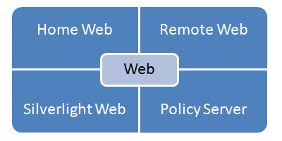



# FRIA

## FleetRace Internet Application

A number of internet applications (FRIA) have been created for the FleetRace project (FR).
The FRIA applications are Silverlight applications.
These applets are used to present results of a sailing regatta.

In contrast to the desktop applications the Silverlight variations of FleetRace can be demonstrated live in a browser.
We have two demo applets online.

## FRIA05

FRIA05 is an applet for presenting static data. The data will be loaded from the server.
In the simplest case the server can be a static web server which serves xml files.

The Silverlight application will download a directory of available files, which is usually given in EventMenu.xml.
The location of that resource is specified in an initialization parameter.
EventMenu.xml contains all information needed to download the individual event data xml files.
Once the event data xml file was loaded from the server FRIA05 can do what it was designed for.
The computation and display of data in the grid is done all within FRIA05 itself,
running inside a sandbox on the client machine (browser or out of browser).

## FRIA01 to FRIA11

Other variations of FRIA may show even more detailed data.
These applets resemble the desktop application even closer.
Some variations can connect back via the network to the desktop application and display live data,
fully synchronized in real time with the server (dynamic Silverlight client).

## FR04

The counter part of the dynamic Silverlight Client is the FR Server application FR04.
FR04 contains a web interface.

- The Silverlight Web serves the Silverlight client to the browser.
- The Policy Server allows the Silverlight client to connect back to the FR Server.
- The Server can be controlled with the Remote Web.
- And via the Home Web data sent from the Silverlight client to the Server can be displayed.

## Design

The look of the Silverlight applications is certainly important.
RiggVar Software intends to collaborate with designer(s) so that an individual look can be provided.
The special design may include the logo of the host club and/or sponsor logos.

The RiggVar FleetRace Internet Applications are licensed for use on a site.
The individual design will be applied when the project is compiled for use on the target site.

Even if one starts with the default look to test the technical aspect an update of the design is can always be done later.
