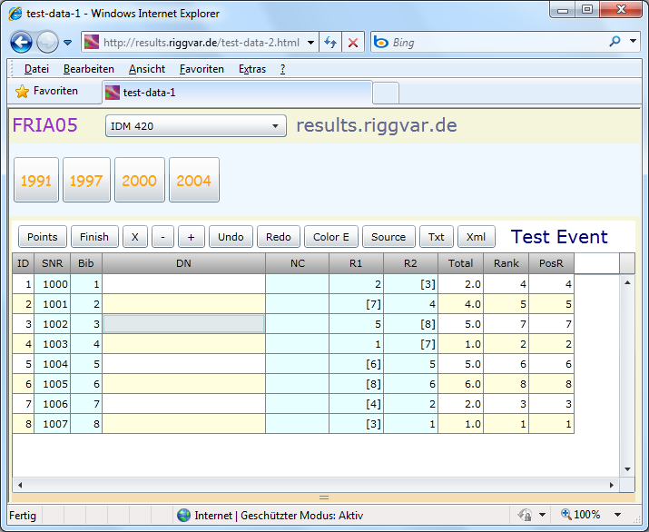



# FRIA05

## From 2012

The FR desktop applications [FR04](../applications/FR04.html), [FR62](../applications/FR62.html) feature an embedded server,
which can serve the Silverlight Client, besides of dynamic Html pages and Ajax clients.

The image (screenshot) shows FRIA05, when served from the desktop application.

- FRIA05 can be served by a static web site.
- In addition to the .xap file for the Silverlight application itself you only need to provide the xml files for the events
and a directory listing of these files in form of EventMenu.xml.
- The server can be a Linux web server, of course.
- The application has been tested with Internet Explorer, Firefox and Safari.

You could try it out from the Demo page (in 2012).
