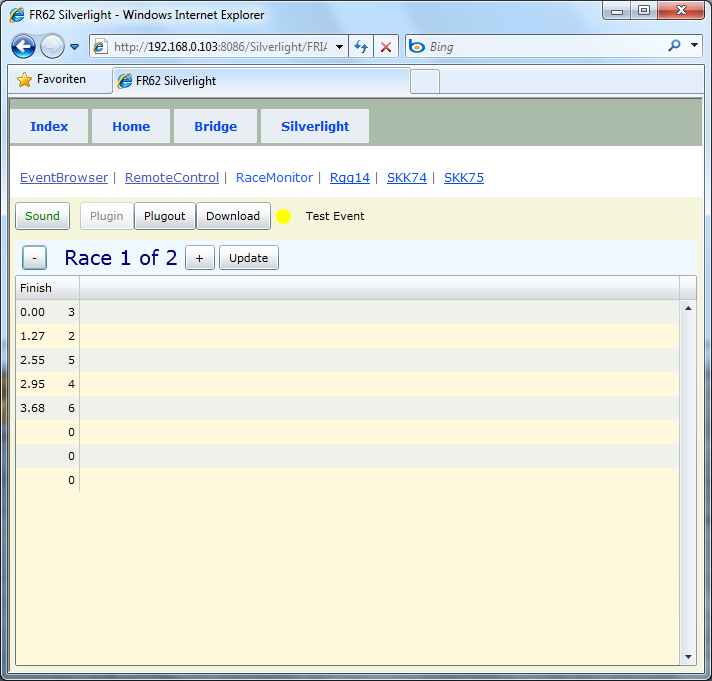



# FRIA11

FRIA11 can be used to display intermediate times at mark roundings.

In the picture you can see the finish time point (IT0 alias FT for Race 1.
If more than zero intermediate time points (ITX) are configured, a corresponding number of columns will be shown in the grid.
By looking at the time behind you can follow the progress of the race.

TV images are unbeatable, no one wants to see the computer simulation.
Tracking systems are complex and costly to set up, 
but the Fleetrace Internet applications in combination with manual input in real time are perhaps a good alternative.
