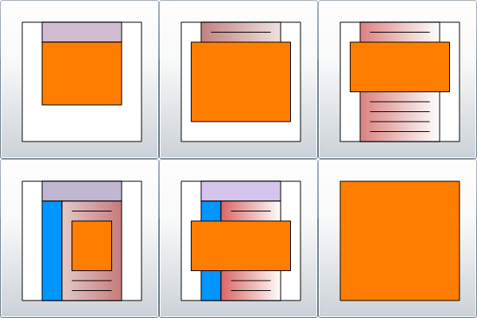



# FRIAS Layout

> Note: Silverlight is a discontinued technology.

FRIAS is a Silverlight Control that can be placed on a web page using different size and position.
The user could choose a layout with the help of **DemoMenu.xap**, wich is also a Silverlight Control:

*Screenshot of DemoMenu.xap*<br>


The orange rechtangle is supposed to be FRIAS, in the desired size and position.

There may or may not be other elements on that page, like normal content.

## DemoMenu.xap

It was placed on a page like so:
```html
<div id="silverlightControlHost">
<object data="data:application/x-silverlight-2," 
  type="application/x-silverlight-2" width="600" height="400">
<param name="source" value="http://www.fleetrace.org/ClientBin/DemoMenu.xap" />
<param name="background" value="white" />
<param name="minRuntimeVersion" value="4.0.50401.0" />
<param name="autoUpgrade" value="true" />
```

In order to see the Silverlight Control you need to use Internet Explorer browser.
IE 11 on the latest Windows 10 should be good.

> The old Silverlight projects cannot be loaded into Visual Studio 2019 any more.
> But I can open the projects in VS Code and have a look.

Back to the test of DemoMenu.xap. 
The control appears on the screen ok, but when I click a button nothing happens.
It was expected to take me to another html page with **FRIAS.xap**, supposed to be configured to have the chosen layout.

> It worked in the past.

TODO: replace layout selector xap with simple Image.

The good news: If I call up [FRIAS](FRIAS.html) host page directly it still works.

## Full Screen (Align Client)

In order to show FRIAS as big as possible in the browser window, and to keep it aligned when resizing,
some css and javascript is used, like so:

```html
<!DOCTYPE html PUBLIC "-//W3C//DTD XHTML 1.0 Transitional//EN" 
  "http://www.w3.org/TR/xhtml1/DTD/xhtml1-transitional.dtd">
<html xmlns="http://www.w3.org/1999/xhtml">

<head>
<meta content="text/html; charset=utf-8" http-equiv="Content-Type" />
<meta content="de" http-equiv="Content-Language"/>
<meta name="robots" content="noindex,nofollow"/>

<title>FRIAS-6</title>

<script src="javascripts/jquery-1.4.1.min.js" type="text/javascript"></script>

<style type="text/css">
   html, body {
     height:100%;
     width:100%;
     overflow:hidden;
   } 
   #silverlightControlHost {
     height:100%;
     width:100%;
     margin:-10px;
     position:absolute;
   }
</style>

<script type="text/javascript" id="SilverlightResizeScript">
$(pageReady);
function pageReady() {
$(window).resize(onWindowResize);
};
function onWindowResize() {
var b = $("body");
var d = $("#silverlightControlHost");
d.height(b.height() - d.offset().top);
d.width(b.width() - d.offset().left);
}
</script>

</head>
<body>

<div id="silverlightControlHost">
<object type="application/x-silverlight-2" width="100%" height="100%">
<param name="source" value="http://www.fleetrace.org/ClientBin/FRIAS.xap"/>
<param name="background" value="white" />
<param name="minRuntimeVersion" value="4.0.50401.0" />
<param name="autoUpgrade" value="true" />
<param name="initParams" value="at=5,dock=xy,menuLocation=http://www.fleetrace.org/DemoIndex.xml" />
<a href="http://go.microsoft.com/fwlink/?LinkID=149156&v=4.0.50401.0" style="text-decoration:none">
  
</a>
</object>
<iframe style="visibility:hidden;height:0;width:0;border:0px"></iframe></div>

</body>
</html>
```

This should be the layout variation FRIAS-6, according to button position 6, 
see bottom right button in the picture.

> But it should be all about the modern variations.

I know, but I begin with some history, 
the syntax highlighting with the help of Jekyll and Rouge is beautiful don't you think?
So some *documentation* of the history should be appropriate.

By the way, did you spot the `menuLocation` parameter?
**DemoIndex.xml** here is merely another name for **EventMenu.xml**, 
and the *Event Menu* should be usable with the Angular SPA applications,
and with the desktop applications.