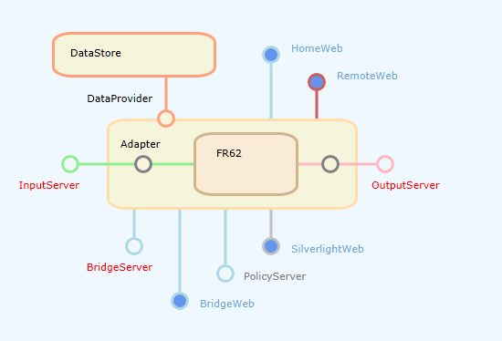

# FR Feature Graph

Feature Graph is or has been another Silverlight Control,
which can / could be served by FRXX / FR69 and loaded into IE via http.
The purpose is to give an overview over open tcp Ports and available http endpoints.

When the user hovers with the mouse over the connection points
the Url (tcp or http) will be shown as a tooltip.
Http endpoints are clickable links.



The graph is displaying information which is contained in the following Xml:

```xml
<?xml version="1.0" ?>
<FeatureMap Host="localhost">
<PortMap>
<Component CID="IS" Port="3427" IsConnected="True" />
<Component CID="OS" Port="3428" IsConnected="True" />
<Component CID="BS" Port="4530" IsConnected="True" />
<Component CID="HW" Port="8086" Path="home/" IsConnected="True" />
<Component CID="RW" Port="8086" Path="remote/" IsConnected="True" />
<Component CID="BW" Port="8086" Path="bridge/" IsConnected="True" />
<Component CID="SW" Port="8086" Path="silverlight/" IsConnected="True" />
</PortMap>
</FeatureMap>
```

The *Silverlight Web* which serves the .xap has a link to retrieve the above Xml as part of the Api,
meaning that you could call up the info independent of the Silverlight control.

But for the Silverlight Web to be available
the control must be present in the ClientBin folder and the Web interface must be enabled.

This is how it is right now.
Usually the Control is NOT available,
because I chose not to upload the outdated .xap file to GitHub.

> Silverlight as a technology is discontinued and needs to be replaced.