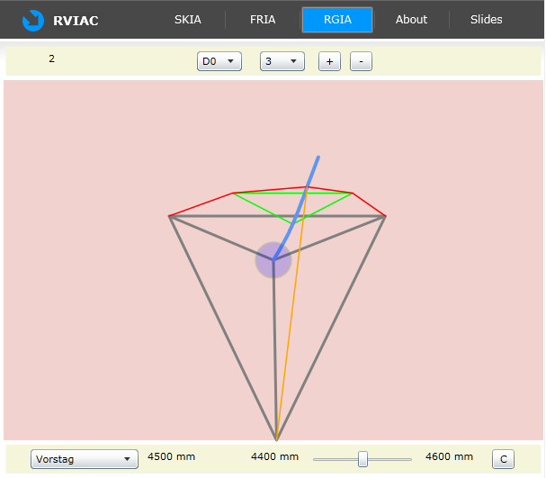
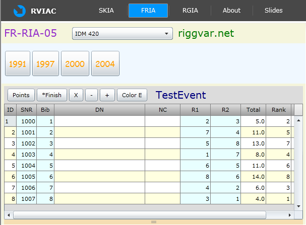



# RVIAC

RVIAC is the combined Silverlight demo application.
Technically it is a so called Silverlight navigation application.
This means that it has several pages for the user to click on.
RVIAC contains the following pages:

- SKIA, shows electronic compasses in an interesting way 
- FRIA, the demo for the Fleetrace project 
- RGIA, the Silverlight variation of the rig applet 
- About, a page with a short help text 
- Slides, a page with a bunch of rig related vector images 

The graph on page RGIA can be rotated/translated with the mouse, and the shape of the graph can be changed too. In order to rotate the graph you drag the mouse over the red background with left and right mouse buttons. In order to translate the graph you drag the mouse within the blue/green circle. In order to change the shape of the graph you use the scrollbar. All other features can be easily discovered by trying out the controls.

Attention: the pictures here on this page are screenshots only.
The will find a live link for the applet below.

The grid on page FRIA shows computed results of a regatta.
Immediately after loading the page it shows default test data.
Using the menu (combo box and button bar) static Xml data can be downloaded from the server.

It is possible to change finish positions and penalty assignments by direct input into the cells of the editable RX columns.
The count of throwouts can be changed with Plus and Minus buttons.
Individual columns can be sorted with a click on the column header.
Button X will exclude/include a race from scoring (please make sure a cell of the race column is focused when clicking the X button).
Points/Finish buttons toggle the display mode (what is shown in the cells).
The Color button will switch between different background coloring schemes.

The RIVAC demo could be launched from the demo start page.

